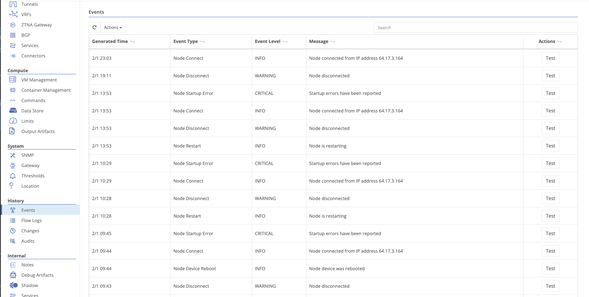

{}
Events are emitted from nodes and from the Trustgrid control plane when actionable things happen. Events are the basis for alarms and notifications.
{}

Events can be viewed for individual nodes by navigating to **Events** under the **History** section.

Events for the entire organization can be viewed by navigating to **Events** under the **Alarms** section.

Clicking the **Test** button will send the event through your configured alarms to help verify channels are configured as expected.

## Date Range



The date range selector is always visible above the events table, showing the currently active time window. The default range is **Last 1w**. Click the date range button to change the range. Use **Advanced Search** to filter by other criteria, and **Clear Advanced Search** to reset those filters.

#### Event Times



The time the event was created.



The time the event was received by the control plane. This can be later than the generated time in the event of a network disruption, for eample.


