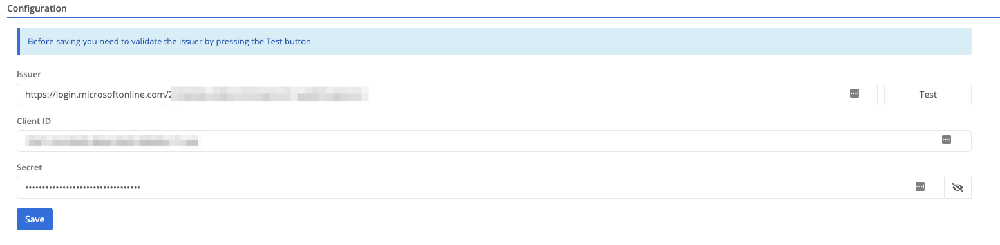
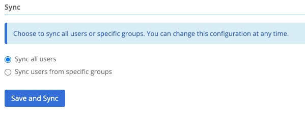
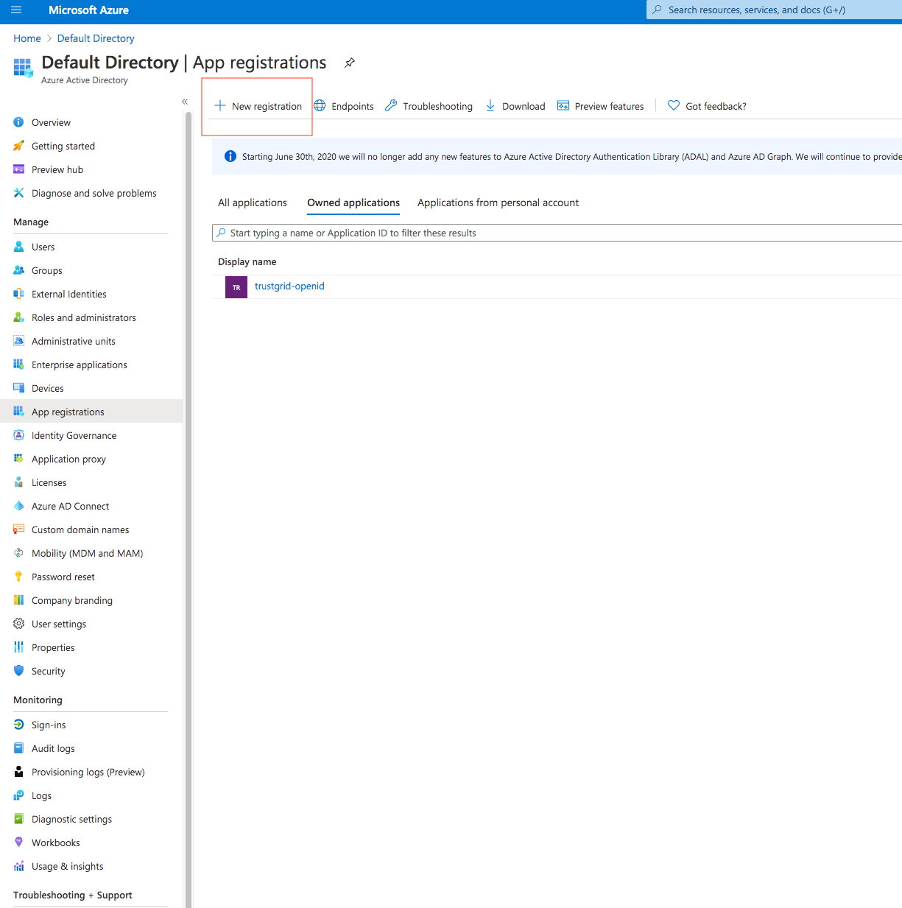
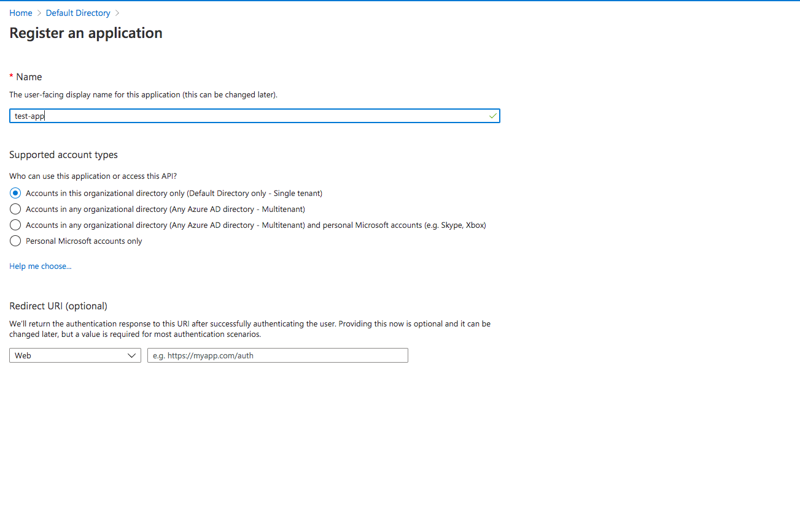
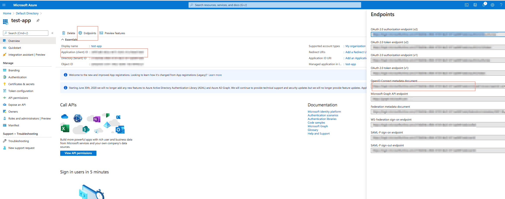
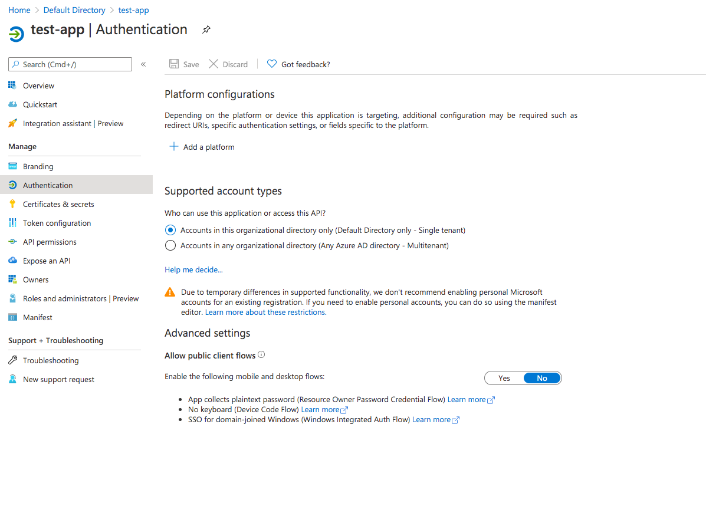
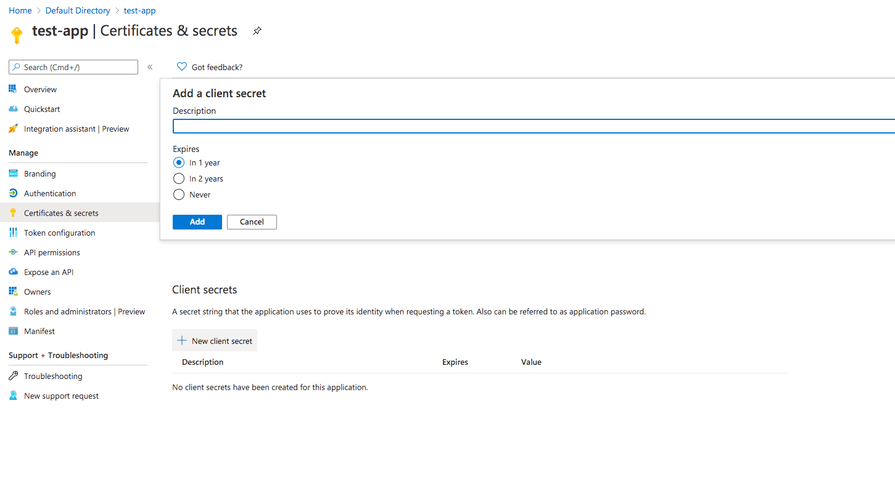
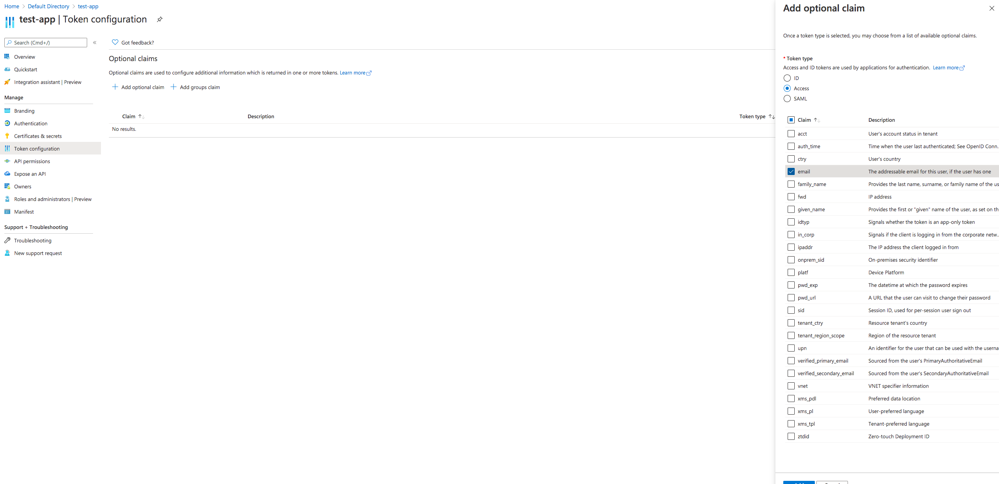

#### Setup

Setting up the Azure AD integration requires the configuration of an Azure App registration.  See [Azure App registration configuration]().

 



Specifies the Azure App OpenID metadata endpoint.


Specifies the Azure App client ID.


Specifies the Azure App secret value (not the secret ID). This is the value that appears only once when you create a new client secret.




Before being able to save the configuration, validation of the Issuer needs to be performed by pressing the **Test** button.


Once the validation has been performed and the configuration saved, the sync section will be available.

 

- Sync all users - Syncs all available users along with all the groups associated to the users.
- Sync users from specific groups - Syncs all users from the selected groups.


- At any given point the sync selection can be changed and saved, and the sync will automatically start. 


#### Azure App registration configuration


The following information is only partial Azure AD reference for configuring an App registration via the Microsoft Azure Portal.  Information presented in the following images might have changed.


1. Create a new **App Registration**

 

2. Once you've registered your application you need to make a note of the Application Client ID and Metadata endpoint that provides the Open ID metadata.  You can find it by click on Endpoints at the top of the application.  The Application Client ID will be used for the Client ID configuration parameter of the Identity Provider in Trustgrid Portal. The metadata endpoint goes in the Issuer configuration parameter
of the Identity Provider in Trustgrid Portal.  It should be something like https://login.microsoftonline.com/<app_id>/v2.0 Ignore what comes after the /.well-known part.

 

3. Configure the Authentication piece of the Azure app

4. Add a platform by selecting the "Web" type and add the corresponding redirect uri and logout url, and select both Access Tokens and ID tokens checkboxes.



https://id.trustgrid.io/auth/openid/callback


https://id.trustgrid.io/logout



5. You need to create a secret for authentication.  You can select the expiration to be any of the selections but it is recommended to give at least 1 year for expiration.  Once you create the secret make sure to make a note of the "value" since that piece of information is what is going to be used under the Secret configuration parameter of the Identity Provider in Trustgrid Portal.

6. Once you've created the client secret, navigate to "Token Configuration" and add the "email" optional claim

#### Updating Expired App Secrets

When your Azure AD client secret expires, you'll need to create a new secret and update it in the Trustgrid Portal. To create a new client secret:

1. Sign in to the Azure portal and navigate to your App registration
2. Select "Certificates & secrets" from the left menu
3. Under "Client secrets", click "New client secret"
4. Provide a description and select an expiration period
5. Click "Add"
6. **Important**: Copy the new secret's "Value" (not the secret ID) immediately, as it will only be shown once
7. Update the Secret field in the Trustgrid Portal with this new value

For more detailed instructions, refer to the [official Microsoft documentation on managing app secrets](https://docs.microsoft.com/en-us/azure/active-directory/develop/howto-create-service-principal-portal#option-2-create-a-new-application-secret).

***