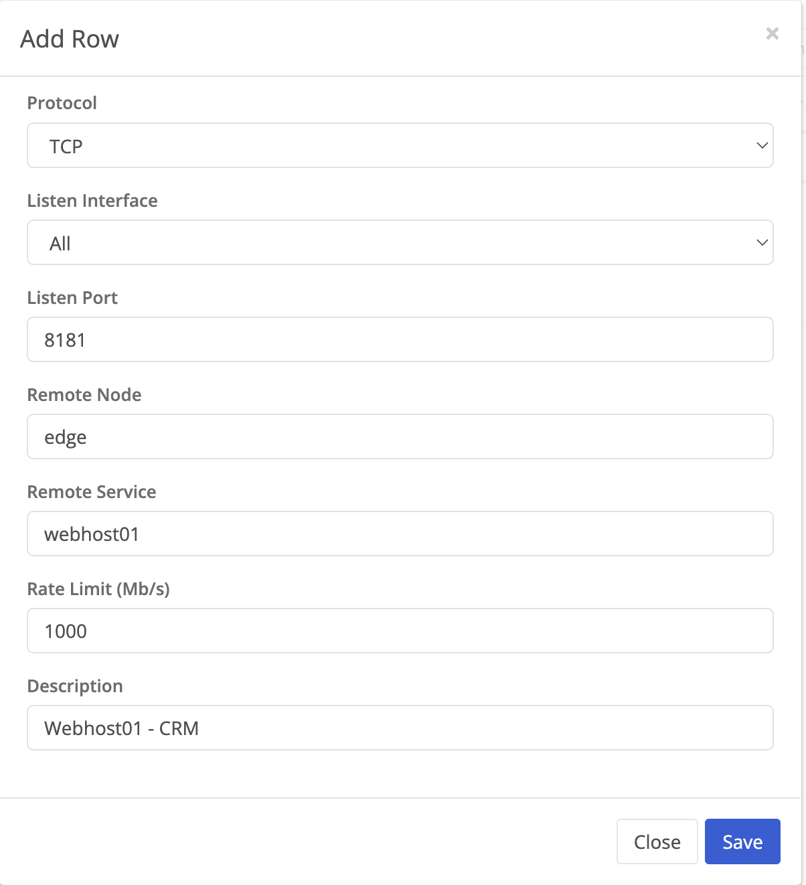

{}
Connectors are configured in conjunction with [services]() to define a local listening port for layer 4 (L4) connectivity.
{}

#### Configuration

Connectors are configured under the Networking > Connectors tab of the node or cluster configuration section in the Trustgrid Portal.


The protocol that the listener for the connector will use. Options are TCP, UDP, FTP, and TFTP.


> FTP must operate in passive mode when using L4 services and connectors.


The interface that you want the connector to listen on. If set to "All", the connector will listen on 0.0.0.0.



The port that you want the connector to listen on.



The remote node or cluster that traffic will be proxied to.



Either the friendly name of [service]() that is defined on the remote node, or the IP:Port of the remote service to connect to.



The maximum amount of throughput that will be allowed to traverse the tunnel when connecting to the connector. This can be used to prevent saturating the connection at either the local or remote sites.

