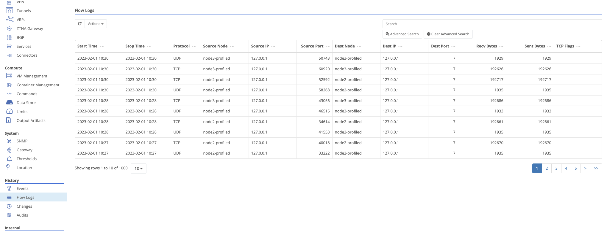
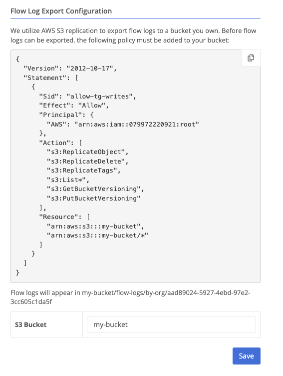

{}
Flow logs are a record of all traffic that passes through a node. They can be used to troubleshoot connectivity issues, or to monitor traffic patterns.
{}

Flow logs for an individual node can be found under the `History` section of the node view. Click the `Flow Logs` tab to view the logs. For the entire organization across all nodes, navigate to `Operations`->`Flow Logs`.

By default, newest flows will be shown first.


The time the flow started


The time the flow ended


The protocol used


The node that initiated the flow


The IP address through which the node initiated the flow


The port through which the node initiated the flow


The node that received the flow


The IP address to which traffic was sent


The port to which traffic was sent


Bytes received at the source node


Bytes sent from the source node


TCP Flags set during the flow:

- SYN - sync packet
- PSH - push packet
- ACK - ack packet
- URG - urgent packet
- FIN - finish packet
- RST - reset packet
  

### Advanced Search

Flow logs can be filtered by any of the fields listed above. To filter by a field, click the `Advanced Search` button at the top right of the flow logs table.

In addition, the ordering can be changed so that oldest flows (or flows closest to the time range specified) can be shown first. There is a limit of 10,000 flows returned per search.

### Exporting Flow Logs

Trustgrid can export flow logs to any S3 compatible bucket. Exports are run every 24 hours.

On the Operations->Flow Logs page, configure credentials to export flows.


The access key to use when making S3 API calls to the target bucket



The secret key to use when making S3 API calls to the target bucket



The bucket name. You must own the S3 bucket and the access credentials must be allowed to write to the bucket.



The region of the S3 bucket. This is used to determine the endpoint to use when making S3 API calls.



The prefix to use when writing objects. If the prefix is, "prefix", then files will be written to s3://your-bucket/prefix/tg-flow-logs-YYYY-MM-DD.csv.gz


After saving credentials, Trustgrid will attempt to write an empty file named `validation` to the bucket and prefix provided. Any errors will be displayed on the page.
