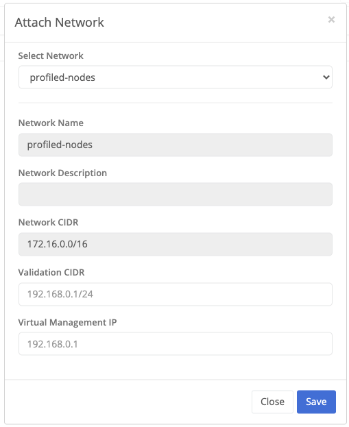

{}
Trustgrid nodes can be configured to provide VPN-like functionality, allowing network address translation (NAT) and routing between nodes.
{}

The VPN feature enables routing of IP packets by utilizing a virtual IP space that is configured on the nodes. In this configuration, the node can be used as the next hop for route destined for the virtual IP space, or the node can be used as the default gateway for a network. The virtual IP space is used as a transit network with NAT being utilized to translate IP addresses on to/from the virtual IP space on either side. It is also possible to preserve the original source and destination by having the virtual IP space be identical to the LAN network.

The Trustgrid VPN feature provides the capability to securely route IP packets between remote networks. In this configuration, Trustgrid nodes can operate as a distributed mesh virtual private network (VPN) that can allow applications to access remote data and services at layer 3 (L3) of the network OSI model. This is done by defining a virtual L3 network (similar to an Amazon VPC) and then selecting how local node networks are exposed and translated into the the virtual address space.

## Attaching a Network

To use VPN functionality, a node or cluster must be attached to a domain [virtual network]().

Navigate to the `VPN` section for your node or cluster, and select `Actions`->`Attach`.

The network name (defined on the domain) to attach

The network CIDR

The network route CIDR

The virtual IP address to use in this network

Once attached, navigate into the network to manage the VPN configuration.
