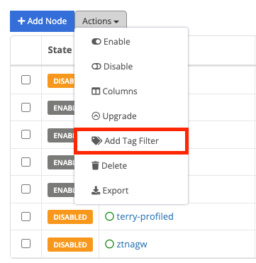
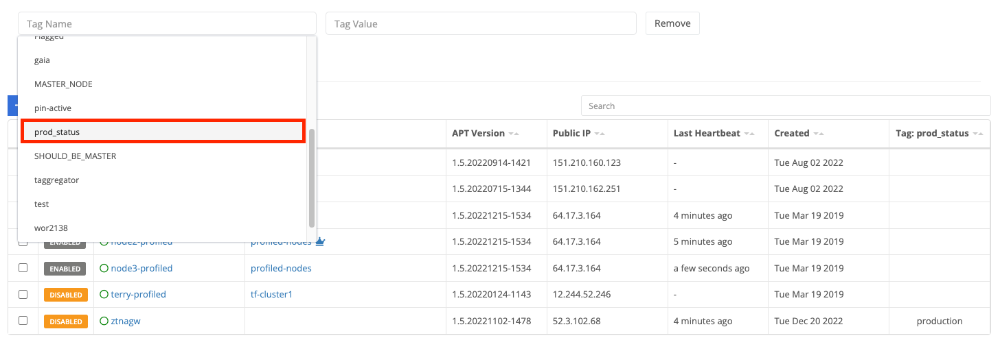
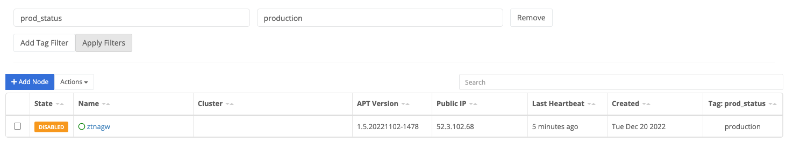

{}
A node is an instance of software used for building connections, managing compute resources, and deploying software.
{}

## Node Types

A node can be installed on a hardware appliance, as a virtual appliance (Vsphere and Hyper-V), and deployed in a public cloud (Amazon AMI, Google, Microsoft). There are three main types of nodes - Edge, Gateway, and Management.

All Trustgrid nodes run on a hardened Ubuntu operating system. Nodes are managed through the Trustgrid portal or via the API (requires authentication token). A local UI exists to support the reconfiguration of an ethernet interface and diagnostic/network tests prior to connection to the Portal.

### Edge Nodes

Edge Nodes build outgoing TLS tunnels to Gateway Nodes. Bidirectional traffic is supported through this tunnel, subject to ACLs and [security]() policy restrictions. Edge Nodes will only require a firewall rule change if outbound internet restrictions are in place. Edge nodes can be a target for software deployment. Edge Nodes can be deployed with a single or multiple ethernet connections to support deployments behind a firewall or adjacent to a firewall (public WAN / private LAN).

### Gateway Nodes

Gateway Nodes accept incoming TLS tunnels from Edge Nodes. Traffic on these tunnels is bidirectional, as permitted by ACLs or policy. Gateway Nodes usually require a firewall change to permit the incoming traffic. Gateway Nodes are identical to Edge Nodes but with a gateway configuration applied. Gateway nodes only connect to other gateways if one is of type `hub`. Read more about [gateway configuration]().

### Management Nodes
Management Nodes are not like other [nodes]() because they do not connect to the data plane, only the control plane. Management Nodes are deployed by Trustgrid for each customer and are multi-tenant like other control plane components. Customers may elect to deploy their own Management Nodes in place of multi-tenant Management Nodes. Management Nodes facilitate the monitoring, management, and support of Edge and Gateway Nodes.

## Node Form Factors



## Node List View

### Adding Node Appliances - Generating Licenses 
Appliance-based nodes need a license generated by the Trustgrid control plane to register with your organization.  This license can be generated in the portal from the Nodes page.
1. Navigate to the Nodes list view.
1. Click the **Add Node** button.

1. Enter a name for the node and click **Create License**.

1. A license key will be generated and displayed.  Clicking in the license text window will automatically copy the license into your clipboard, or you can click the **Download License** button.


### Adding Node Agents - Generating Tokens
Agent-based nodes require a token generated by the Trustgrid control plane to register with your organization. This token is also generated in the portal from the Nodes page.
1. Navigate to the Nodes list view.
1. Click the **Add Agent** button.

### Adding Columns on the Nodes Table

Many additional fields can be added to the Nodes table. These include:


Shows if the node is currently connected to the Trustgrid control plane. Can be used to sort by online/offline status.
Shows the running software version and APT package version installed on the node.
Shows the underlying operating system version.
Shows the device model for appliance nodes. This could be a hardware model or a virtual appliance type.
Shows the public IP address of the node as seen by the Trustgrid control plane.
Shows the last time the node communicated with the Trustgrid control plane.
Shows the date the node was created and registered with Trustgrid.
Shows if SSH lockdown is enabled on the node.
Shows if the node's configured DNS servers are resolving correctly.
Shows if the node can reach the Trustgrid APT repository for software updates.
Shows the node's role (Edge, Public Gateway, Private Gateway, Hub Gateway).
Shows if [hop monitoring]() is enabled on the node.
Shows the geographical location and ISP of the node based on its public IP address.
Shows the last time the node disconnected from the Trustgrid control plane.
Shows if UDP data plane tunnels are enabled on the node.
Shows the node's lifecycle state (pre-production, production, maintenance, decommissioned).
Custom key:value pairs assigned to nodes.
Shows the virtual management IP assigned to the node for each virtual network attached.


To add the column:

1. Navigate to the nodes table page
1. Click `Actions` and then select `Columns` from the dropdown menu. 
1. Towards the bottom you will see all the available tags in the format `tag: tag-name`. Select the desired tag and click `Save`. 
1. The column will be added and the table can now be sorted by that column. Any node that does not have that tag set will be listed as blank. 

### Applying a Tag Filter to the Nodes Table

The nodes table can also be filtered to only show nodes with a specific tag name:value.

1. On the nodes table click `Actions` and select `Add Tag Filter` from the drop-down menu.

1. After clicking `Add Tag Filter`, select the tag-name field and you will see a list of tag-names available. Select the desired tag.

You can also start typing to filter what tag names are shown.

3. Select the tag value field and you will see a list of available values. Select the desired value.

4. (Optional) Click `Add Tag Filter` to include an additional filter. Note that the two filters will be applied using AND only nodes with both tag name:value combinations matching will be shown.

5. Click `Apply Tag Filter` and the table will only show matching nodes.

