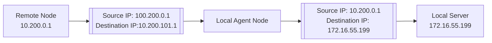
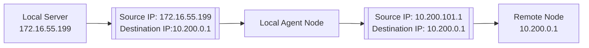



## Enable Forwarding
This check box determines if an agent will attempt to forward traffic to/from between the VPN tunnel interface and IP addresses and networks accessible via other interfaces on the agent. 

### Managing Forwarding
This option is deselected by default. To enable, select the check box and click Save.

## Network Address Translation
By default, all forwarded traffic retains the original IP address local to the agent. It is common to want or need to translate these addresses to avoid IP conflicts or to maintain consistent IP address spaces. The Network Address Translation table allows for mapping the local IP addresses or networks to virtual IP addresses or networks. 


The local IP address or address block that should be mapped into the virtual network. It should be entered in CIDR block format (eg - `192.168.100.0/24` or `192.168.100.51/32`).

The network IP address or addresses that the local IP addresses should be mapped to, also entered in CIDR block format.
(optional) Allows for a user friendly description of the NAT rule.


### Example NAT

Using the example shown in the screenshot above, the local IP address 172.16.55.199 is translated to 10.200.101.1 when forwarding traffic from the VPN tunnel interface to the local network.

The translation works in the other direction as well

### Managing NAT Rules

#### Add Agent NAT Rule
1. Navigate to the desired Agent's Address Translation page.
1. Click the "Add Entry" link below the Network Address Translations table.
1. Enter the Virtual CIDR and Local CIDR address ranges to map. Optionally, provide a description.
1. Click the green check box to the right of the rule.
1. (Optionally), repeat with additional rules.
1. Click Save

#### Delete Agent NAT Rule
1. Navigate to the desired Agent's Address Translation page.
1. Click the X symbol to the right of the rule you wish to remove.
1. (Optionally), repeat with additional rules.
1. Click Save
