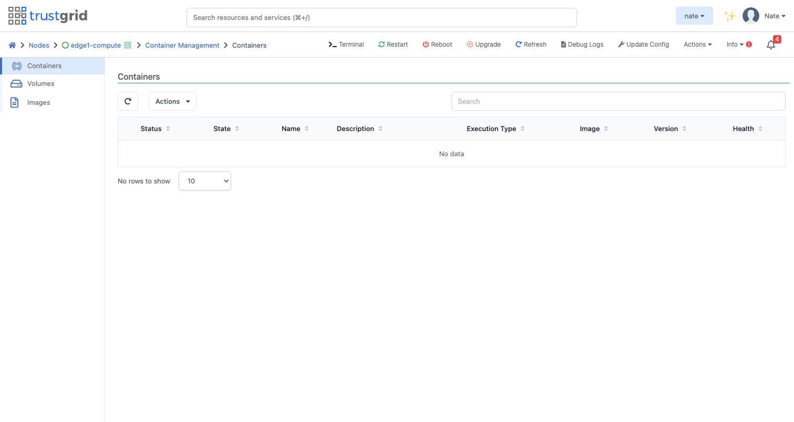
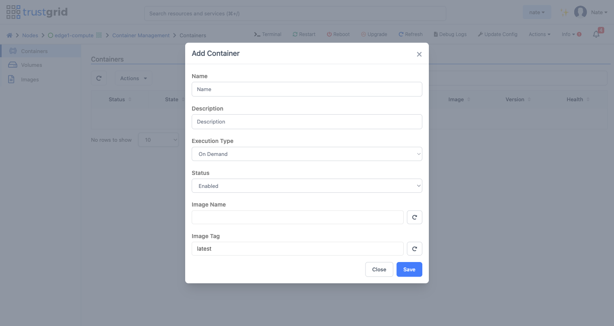
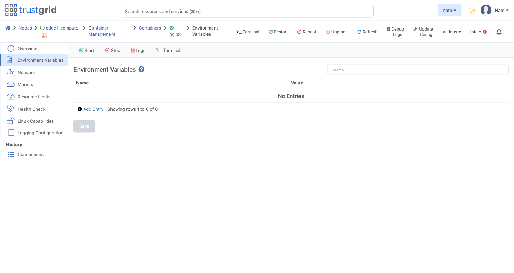
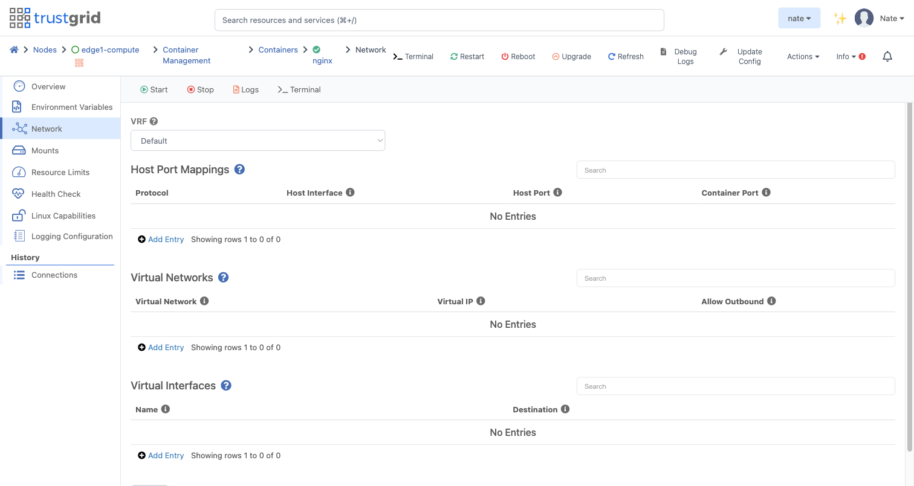
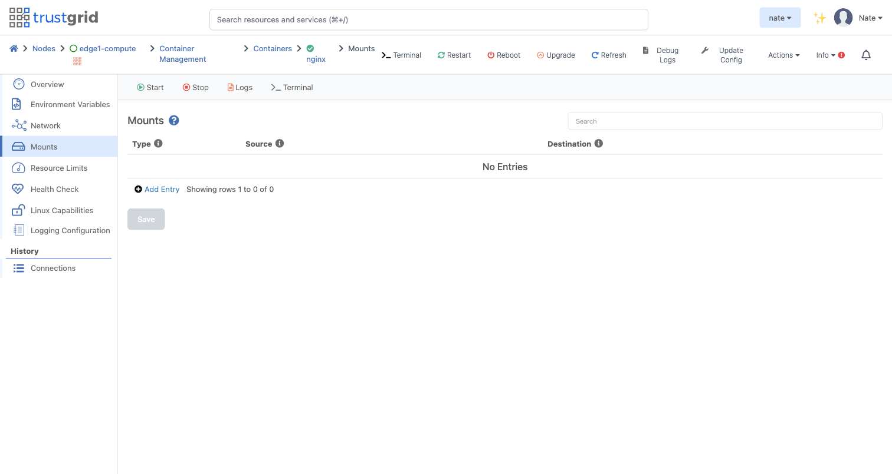
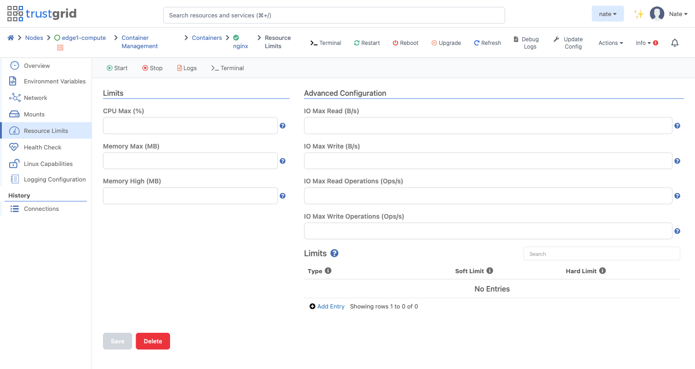
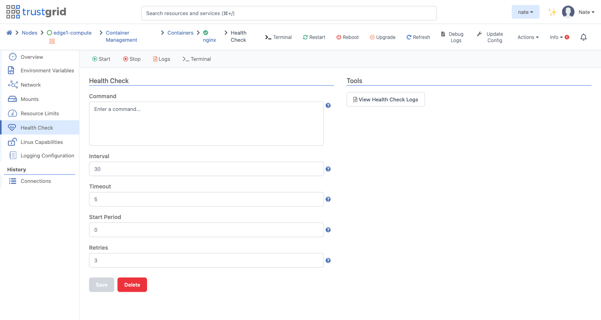
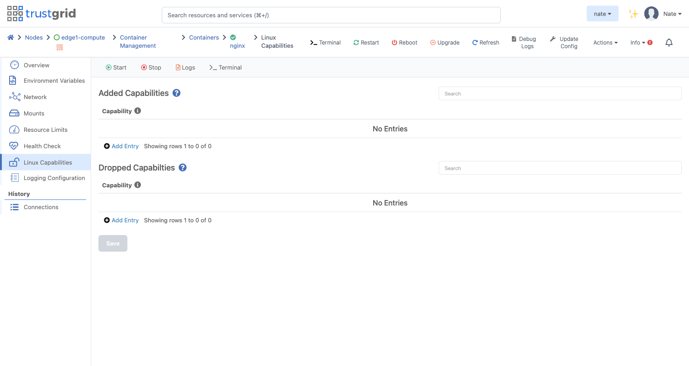
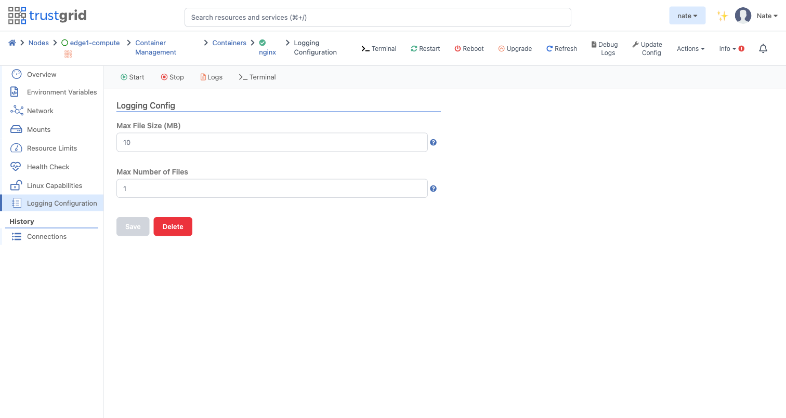

Trustgrid nodes can run container images built to the Docker/OCI image spec, which allows for ease of deployment across an organization. Containers run with least-privilege defaults; workloads that need elevated access can opt into specific Linux Capabilities or full Privileged mode. [Container security]() covers the implications of each.

The container can be attached to both the local and virtual network space which allows both local and remote resources to communicate with the container. For example an API could be deployed on a Trustgrid Gateway which sends API Calls via the virtual network space to a container running on a Trustgrid Edge Node. The API call could then be translated to make a call to a database running on the local network and passed back up to the gateway host.

Before adding a container to a node, push an image to your [repository](). Pushes must be `linux/amd64`; [supported image platforms]() covers the Apple-Silicon caveat.

Reading and managing containers requires `node-exec::read` and `node-exec::modify` permissions, respectively. Executing a container requires `node-exec::compute` permission.

## Where to start

- **New to running containers on Trustgrid?** Start with the [Container Quickstart]() — push an image, run it, reach it from the LAN in about 10 minutes.
- **Need to reach the container from a peer node over VPN?** Follow [Expose a container over a virtual network]().
- **Persist data?** See [Container storage]().
- **Operating a running container — logs, terminal, restart?** See [Container Tools]().

## Concepts

- [**Container networking**]()
- [**Container lifecycle**]()
- [**Container storage**]()
- [**Container security**]()

## Cluster scope vs node scope

Container configuration is set at the **cluster** level on a cluster, or at **node scope** on a standalone appliance. The runtime controls — Start, Stop, Logs, Terminal — are always at the node scope of the appliance running the container. The portal redirects you between these views as appropriate. See [Container Tools]() for the full breakdown.

## Management

Navigate to **Container Management** under **Compute** on a node or cluster.

Available actions from the **Actions** menu:

- **Add Container** — opens the Add Container modal.
- **Delete** — removes the selected container after a confirmation.
- **Enable** — enables the selected container so it will run.
- **Disable** — disables the selected container so it will not run.
- **Import** — copies a container definition from another node or cluster.
- **Export** — exports the selected container definitions to a file.


The name of the container.
Free-text description for the container.
`Service`, `Recurring`, or `On Demand`. Determines when and how often the container runs and whether it restarts on exit. See [Container lifecycle]().
Only `Enabled` containers will run.
The name of the image to execute, in the form `<your-namespace>/<image>`.
The image tag to execute.


## Overview

The overview section allows editing basic information about the container's execution environment.




Persist standard output/standard error to the Trustgrid cloud for analysis. **It is the customer's responsibility to ensure no privileged information is included in the output.** See [Container security — Save Output]().
Cron expression or rate (e.g. `rate(1 hour)`) that governs when the container runs. Shown only when **Execution Type** is `Recurring`. See [Container lifecycle — Recurring]() for the accepted formats.
The command to execute inside the container. Overrides the image's entrypoint. Useful for troubleshooting.
The hostname set inside the container. Defaults to the appliance's name.
Grace period (in seconds) to allow a container to stop before killing it. Defaults to 30 seconds.
Sets the username/group/UID/GID the container's main process runs as. See [Container security — User]().
DNS server for resolution inside the container. By default the container uses the appliance-side resolver at `172.18.1.2` which resolves other containers by name and forwards external lookups. See [Container networking — DNS resolver]().
Pins the container to a specific IP in `172.18.0.0/16`. By default the address is assigned dynamically. See [Container networking — The container bridge]().
Grant the container extended privileges — disables most of the sandbox. **Almost no workload should need this.** Prefer [Linux Capabilities]().
Run an init process as PID 1 inside the container. Recommended for any service that spawns child processes. See [Container security — Use Init]().
Gates container startup on the appliance having control-plane connectivity. Used with encrypted volumes. See [Container storage — Encrypted volumes]().


## Environment Variables

Environment variables can be added to a container to provide configuration at runtime.

## Network

Configure the container's VRF, port mappings, virtual networks, and virtual interfaces. **Conceptual background:** [Container networking]().

### Host Port Mappings

Expose a port on the appliance to the container.


`tcp` or `udp`. If unspecified, all traffic is forwarded.
The appliance NIC to listen on (e.g. `ens192`).
The host port to listen on.
The container port that receives the mapped traffic.


### Virtual Networks

Attach a Trustgrid virtual network so peer nodes can reach the container.


The virtual network to attach.
The virtual IP to assign to the container.
Whether the container may originate connections onto the virtual network.


See [Tutorial: expose a container over a virtual network]().

### Virtual Interfaces

Forward all traffic from an appliance-side virtual interface into the container as a dedicated interface.


The virtual interface name on the appliance.
The interface name presented inside the container.


## Mounts

Persist data either as an externally defined [volume](), or a bind mount of the appliance's filesystem. **Conceptual background:** [Container storage]().


`BIND` or `VOLUME`. For `VOLUME`, the source must reference an existing [volume]().
For volumes, the volume name. For bind mounts, the absolute path on the appliance's filesystem.
The mount location inside the container.


## Resource Limits

Restrict the resources a container can consume from the host.


Maximum CPU allocation. Default is 50%.
Hard RAM limit. Default is 50% of host memory.
Soft RAM limit. Cannot exceed hard limit. Default is 45% of host memory.
Max IO read bytes/sec. Disabled by default.
Max IO write bytes/sec. Disabled by default.
Max IO read ops/sec. Disabled by default.
Max IO write ops/sec. Disabled by default.


Linux `ulimit`s can also be set per container. Supported ulimits: `CORE`, `DATA`, `FSIZE`, `LOCKS`, `MEMLOCK`, `MSGQUEUE`, `NICE`, `NOFILE`, `NPROC`, `RSS`, `RTPRIO`, `RTTIME`, `SIGPENDING`, `STACK`.

## Health Check

Configure a probe that monitors container health. A health check periodically runs a command inside the container and uses its exit code to mark the container `Healthy` or `Unhealthy` in the portal. It's a reporting mechanism only — the container is not automatically restarted on failure.


Command to run. Non-zero exit means failure.
Seconds between checks.
Seconds to wait for a check; timeout counts as failure.
Grace seconds during container startup before checks begin.
Failures allowed before marking the container unhealthy.


## Linux Capabilities

Add or drop specific Linux capabilities. Always prefer this over enabling `Privileged`. See [Container security — Linux Capabilities]().

## Logging Configuration

Rotate persisted container logs (when **Save Output** is enabled).


Maximum log file size before rotation.
Maximum number of rotated log files to keep.

