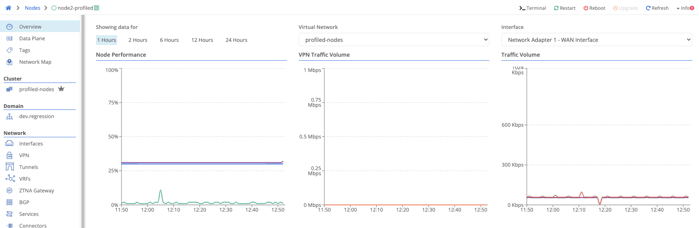
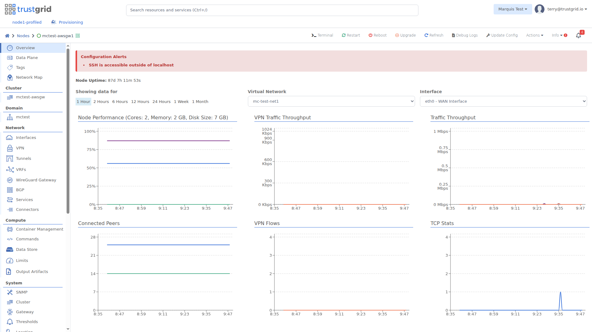

### Stats

The Node overview page shows performance and network traffic data.

Supported time windows are selectable at the top. VPN and network statistics can be targeted to specific virtual networks and interfaces.



shows CPU, disk, and memory usage percentages


shows data usage sent and received, across all VPNs and for the selected virtual network


shows data sent and receives, across all interfaces and for the selected interface


shows the number of other nodes connected. This will change based on the node type - gateways connect to all edge nodes, while edge nodes only connect to gateways.(LINK HUB GATEWAY PAGE WHEN DOCUMENTED)


shows new and active flows, across all VPNs and for the selected virtual network


shows aggregate TCP packet and state statistics across all interfaces



### Data Resolution

The **Showing data for** time window controls how many data points the graphs plot, not how often stats are collected. As the time window grows, each plotted point represents a coarser interval:

| Time Window | Interval Between Points |
|---|---|
| 1 Hour / 2 Hours | 1 minute |
| 6 Hours | 2 minutes |
| 12 Hours / 24 Hours | 5 minutes |
| 1 Week | 60 minutes |
| 1 Month | 6 hours |


At 1 minute resolution (the **1 Hour** and **2 Hours** windows), CPU, memory, disk, uptime, and gateway active/available are point-in-time readings taken at the plotted interval, not averages over that interval.

At coarser resolutions (**6 Hours** and longer), these same metrics are the mean/average across the interval rather than a point-in-time reading.

Traffic stats such as bytes sent/received, gateway bytes, and resets are deltas against the previous interval's cumulative counter, rather than point-in-time readings.

