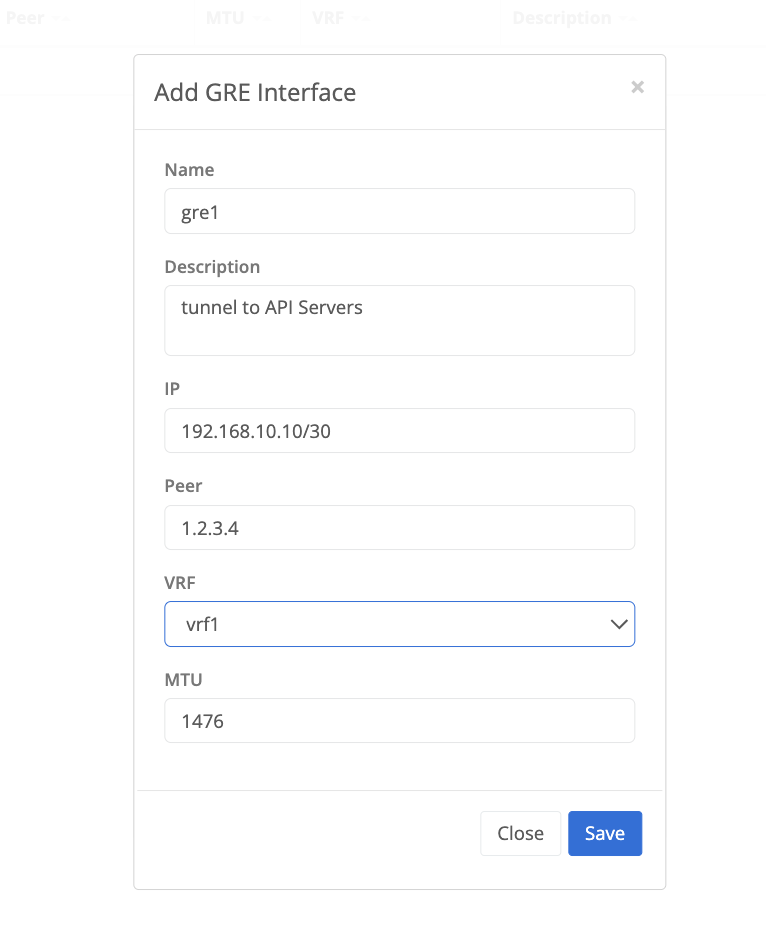

{}
Trustgrid supports configuring GRE tunnels that can be used to establish connectivity to any appliance that supports the GRE protocol.
A GRE tunnel interface is created which can then be attached to an interface on a node. [VRF]()s can then be used to control the flow of traffic and how it should appear on the network. 
{}

## Configure GRE Tunnel 
On a Trustgrid Node navigate to Tunnels under the Network Menu, select Add Tunnel, and then select GRE

### GRE Tunnel Configuration Parameters


 The name of the GRE tunnel interface that will be created on the Trustgrid node 
 (optional) Used to document the purpose of the tunnel 
 the IP address assigned to the node's tunnel interface in CIDR notation 
 the remote IP address of the device the tunnel is being established with 
 existing [VRF]() on the node the tunnel is being associated with
 the maximum transmission unit (MTU) of the tunnel interface. Typically should be set to 1476 or lower. 
