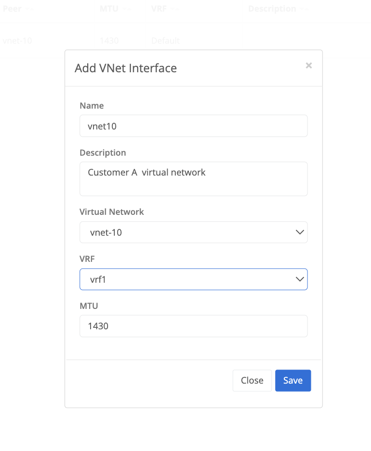

{}
A virtual network tunnel interface can be configured on a Trustgrid node or cluster to allow the forwarding of traffic to a remote Trustgrid Node or Cluster that is attached to the same virtual network. The tunnel interface is associated with a [VRF]() which is used to define and control what traffic is allowed to pass and how it should appear on the network. There is no attachment of the vnet interface to a node interface required but the virtual network does need to be attached to the node or cluster before the tunnel interface is created. 
{}

## Configure VNET Tunnel
On a Trustgrid Node navigate to Tunnels under the Network Menu, select Add Tunnel, and then select VNET

#### Configuration Parameters

the name of the tunnel interface created on the Trustgrid Node or Cluster
 (optional) descriptive parameters related to the tunnel 
 the Trustgrid virtual network the tunnel is being associated with. The virtual network should already be attached to the node or cluster to be selectable. 
The [VRF]() the tunnel is being associated with. Only VRF's which exist on the Trustgrid Node or Cluster can be selected.
 the maximum transmission unit (MTU) size of the tunnel interface. Typically the default of 1430 should be used. 

