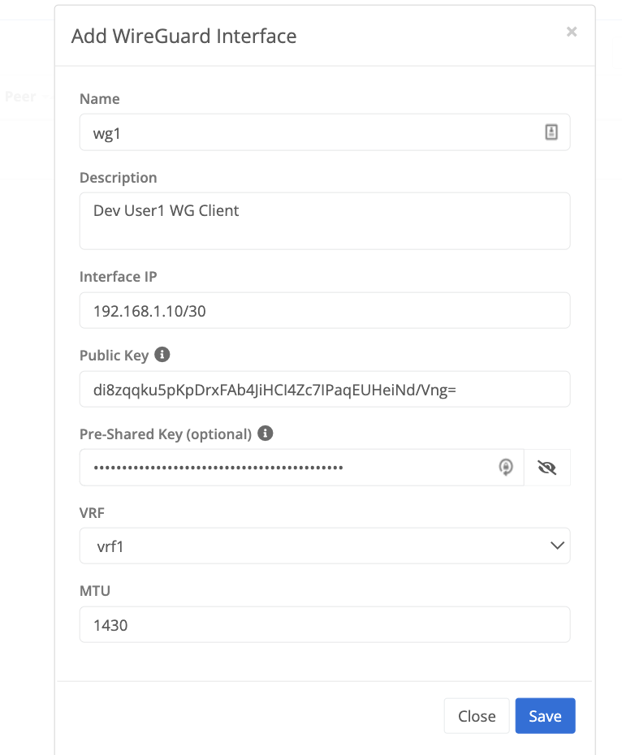

{}
A WireGuard tunnel interface can be configured to allow a WireGuard client to connect to a Trustgrid Node running as a WireGuard server. 
The tunnel interface is associated with a [VRF]() which is used to define and control what traffic is allowed to pass and how it should appear on the network.
{}

## Configure WireGuard Tunnel
On a Trustgrid Node navigate to Tunnels under the Network Menu, select Add Tunnel, and then select WireGuard

### WireGuard Configuration Parameters



The name of the WireGuard tunnel interface created on the Trustgrid node or cluster.



Optional field used to document what clients are utilizing the tunnel.



The IP address in CIDR notation that will be assigned to the node's WireGuard tunnel interface.


 
The public key of the remote WireGuard client.



Optional 256-bit to provide an additional level of security.



The Virtual Routing and Forwarding ([VRF]()) table of the WireGuard tunnel will be attached to



The maximum transmission unit (MTU) of the WireGuard tunnel interface.  Defaults of 1430 or lower are recommended.




## Example Client Config
As you configure a WireGuard tunnel interface the portal UI will automatically generate an example WireGuard configuration for the peer/client based on the information provided.



 Note: this is only a partial config. You will likely need to adjust the `AllowedIps` and other fields to meet the needs of the configured tunnel.


