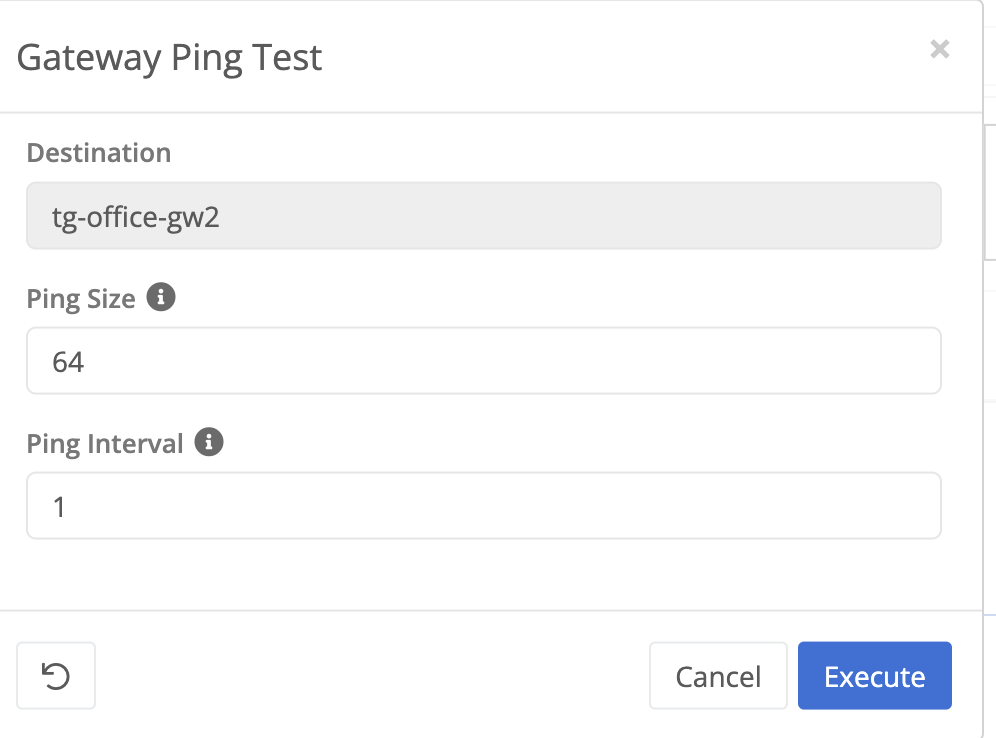
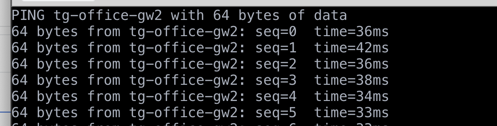
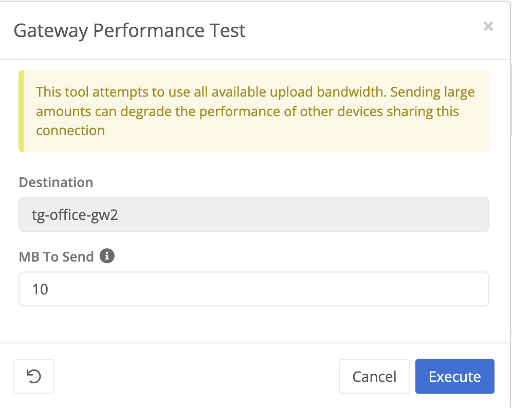
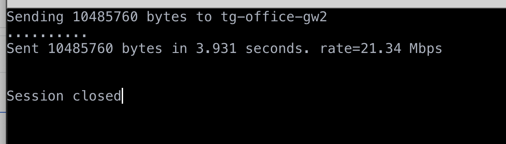
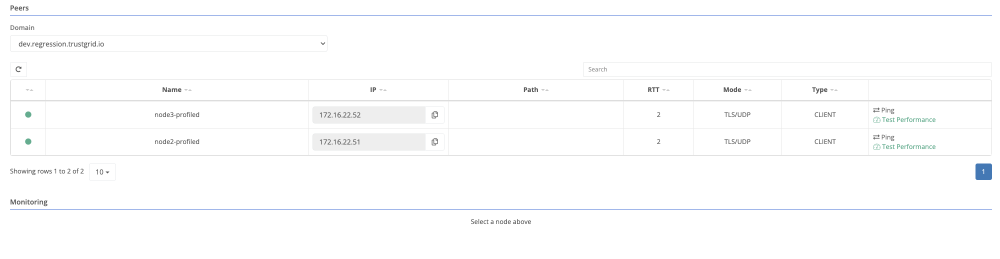
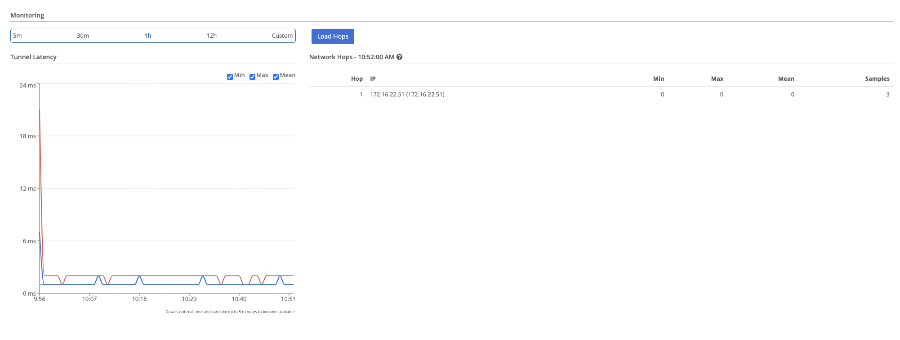

{}
The Data Plane panel shows a list of all statistics known peers, their connection status, provides tools for testing connectivity and can display statistics for the connection between the node and the peer.
{}

## Export List of Peers
You can export a CSV formatted list of all peers by clicking Actions -> Export


The CSV file will include columns for:
* Connection status (true/false)
* Peer name
* Peer IP
* Path (if applicable)
* RTT - Return Trip Time or latency observed when the panel was opened or refreshed
* Mode - TLS or TLS/UDP
* Type - The role of the node to peer. SERVER = gateway, CLIENT = edge device
* Ports - The ports used to establish the connection

## Tools
The far right column as links to launch the following tools:
### Gateway Ping

The gateway ping tool will launch a ping inside the data plane tunnel between the node and the gateway, similar to ICMP ping.  This can provide a more realtime view of latency between node and gateway compared to the RTT column (only loaded on refresh) and the historical data which provides a minute by minute view.

### Gateway Performance Tool

The gateway performance tool attempts to estimate the available **upload bandwidth** between current node and the selected peer. 

By default this tool will attempt to send 10MB of data to the destination device. This then used to calculate the available bandwidth.  Sending more data provides a more accurate estimate but be aware that other devices using the same internet circuit may experience degraded performance while the test is running. 

The periods are posted for about every 1MB of data sent. If you see exclamation marks this can indicate lost packets.

### Trace Route and MTR
Both of the links here will populate the [interface tool of the same name]() with the selected peer's IP address and TCP port. This allows you to trace the route or run MTR diagnostics directly between the current node and the selected peer.

This is most effective if run from the client/edge node to a gateway since the gateway is the only one actually listening on that port.  If run in the other direction (gateway -> client) it is likely any firewall between will drop the connections and the client will definitely not respond on that port. 

## View Latency to Peers

To view latency data between two nodes, select either the edge or gateway node, and then from the peers table, select the node to view.

Gateway nodes will list edge nodes in their peers table

Once a peer is selected, the monitoring section will populate with relevant data.

Hop data is only available for nodes that have hop monitoring enabled. See [Monitoring Network Hops to Peers]().
