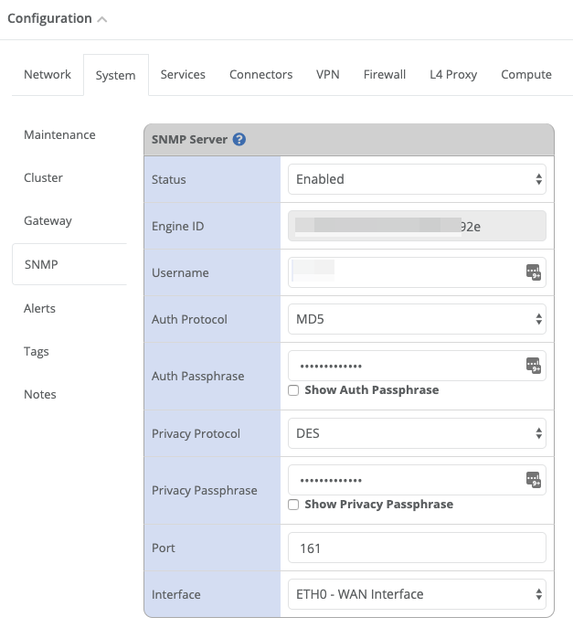

{}
Trustgrid Nodes support SNMP Version 3 for the monitoring of various node resources.
{}

#### Configuration

SNMP is configured under the SNMP tab of the configuration section of the node in the Trustgrid Portal.

Configure all fields and click save. Then set the status to enabled which will start the SNMP service on the node.



Set to enabled to start SNMP service. Setting to disabled will retain the configuration but stop the SNMP service on the node.



Automatically generated



Create SNMP Username to be used by snmp client



Select MD5 or SHA



Configure authentication passphrase of eight or more characters



Select between DES, AES128



SNMP service runs on UDP port 161 by default. Specify an alternate port number to run the service on an alternate UDP port.



This is the interface on which the SNMP service will listen. This should always be set to an interface behind the firewall.

- Loopback - This will listen only on virtual management IPs. Useful for monitoring across the virtual network overlay (e.g. snmp collector is in the remote network)

- ETH0 for single interface setups. Note: if enabled on a WAN interface with public IP SNMP port 161 will show as available on the internet

- ETH1 for dual interface setups





#### Query the SNMP Service

The SNMP Service is listening on the IP address of the Interface chosen along with the Virtual Management IP if configured. The example below is a snmpwalk from a client on the same layer 2 network that the data nic of the edge node resides in.

To query the SNMP service you can use a tool like snmpwalk or similar.

SNMPWALK Example:

snmpwalk -v3 -l authPriv -u snmpuser -a MD5 -A "securepassword" -x DES -X "securepassword" ip.ad.dre.ss

In this example:

MD5 and DES match the configured Auth and Privacy protocols. Be aware that other protocols may be selected

snmpuser matches the configured Username

securepassword after -A is the Auth Passphrase a, after -X is the Privacy Passphrase

ip.ad.dre.ss needs to be replaced with the IP address of the node that you want to target:

If you are querying from the local network, you should use the IP address of the Interface selected on the SNMP config panel

If you are querying from across the virtual network, you’d need to use the Virtual Management IP in the correct Virtual Network.

Running this command should generate output like shown on this page.

Information Provided by SNMP
A full list of all available OID's supported by the Trustgrid Node is listed here.
