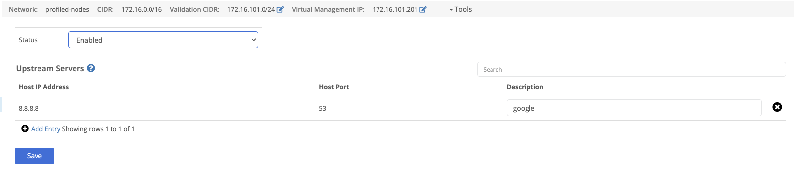

Nodes can act as DNS servers for requests ingressing the the virtual network on the node if [DNS is configured at the virtual network](). 

## DNS Status
This setting must be set to enabled for the node to process requests targeting the configured [virtual network DNS server IP](). 

## Upstream Servers
If configured, the node will use these servers to resolve DNS requests for [zones not configured at the virtual network level](). 


The upstream DNS server's IP address
The upstream DNS server's port (usually 53)
(Optional) a user friends description of the server
