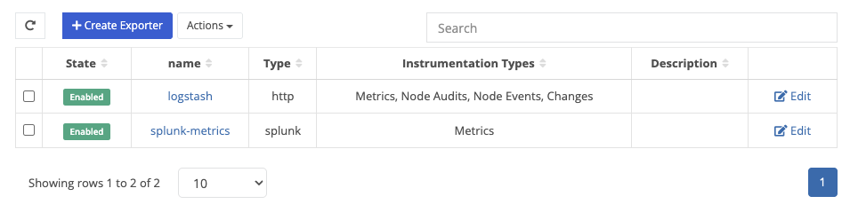
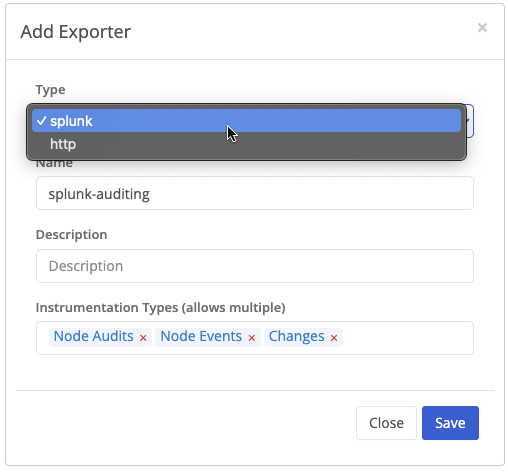
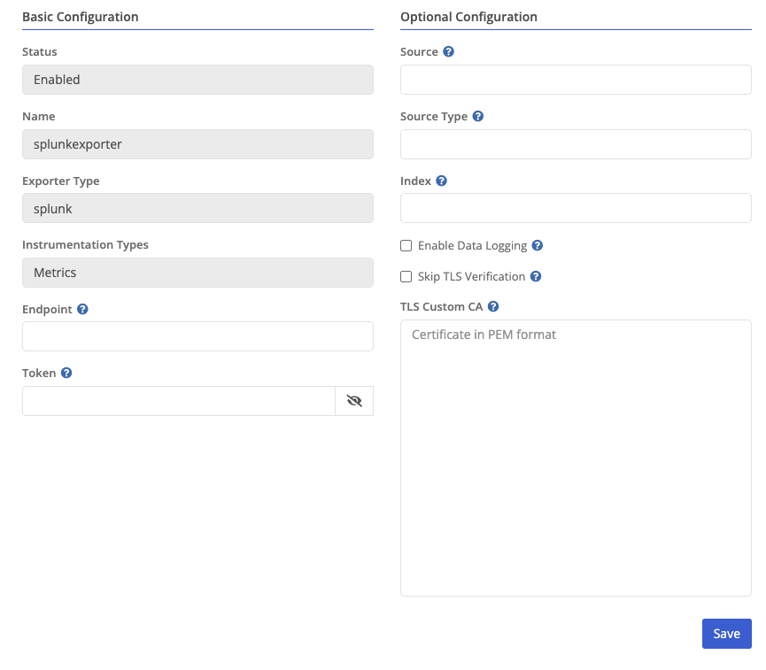
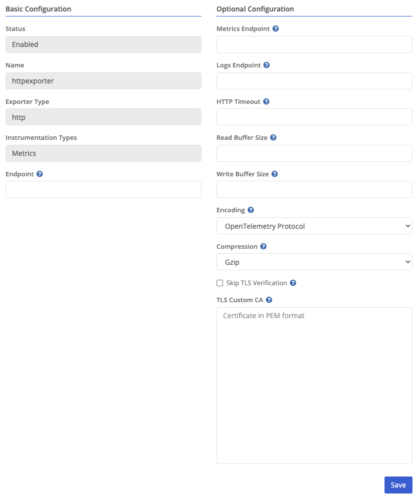

{}
Observability enables exporters for Metrics (stats such as CPU, Memory, Disk, bytes sent/rcv'd, ..etc), [Events](), [Node Audits](), and [Configuration Changes]()
{}

Trustgrid currently supports an OpenTelemetry exporter for [Splunk](), as well as a generic HTTP exporter for platforms that accept either JSON or OTLP-encoded data, such as [Logstash]().

#### Adding an Exporter



Splunk & HTTP are currently suppored


Your desired exporter name


A brief description for your exporter


Categories of data exported by Trustgrid.


The Exporter type cannot be changed after adding an exporter

#### Splunk Exporter Settings



Current exporter status.


Current exporter name.


Configured exporter type.


Current categories of data exported by Trustgrid (e.g. Metrics).


The destination URL for the Splunk endpoint.


The authentication token used to send data to the Splunk endpoint.


Optional: A custom source label for events sent to Splunk.


Optional: A Splunk sourcetype value to help categorize data.


Optional: The name of the Splunk index to send data to.


Enable sending logs (e.g. instrumentation other than metrics) to Splunk.


Disable TLS certificate validation for the Splunk endpoint.


Optional: Provide a custom CA certificate (in PEM format) for TLS validation.



#### HTTP Exporter Settings



Current exporter status.


Current exporter name.


Configured exporter type.


Current categories of data exported by Trustgrid (e.g. Metrics).


Base URL for sending telemetry data via HTTP.


Optional override for the metrics-specific HTTP endpoint (e.g. https://hrl/v2/metrics).


Optional override for the logs-specific HTTP endpoint (e.g. https://hrl/v2/logs).


Maximum time to wait for an HTTP response (in seconds - Default: 30 seconds).


Size of the read buffer used when receiving HTTP responses (Default: 0).


Size of the write buffer used when sending HTTP requests (Default: 512 \* 1024).


Specifies the telemetry data format. Options include JSON or OTEL.


Compression method for HTTP payloads Options include gzip, zstd, and none.


Disable TLS certificate validation.


Optional: Provide a custom CA certificate (in PEM format) for TLS validation.


