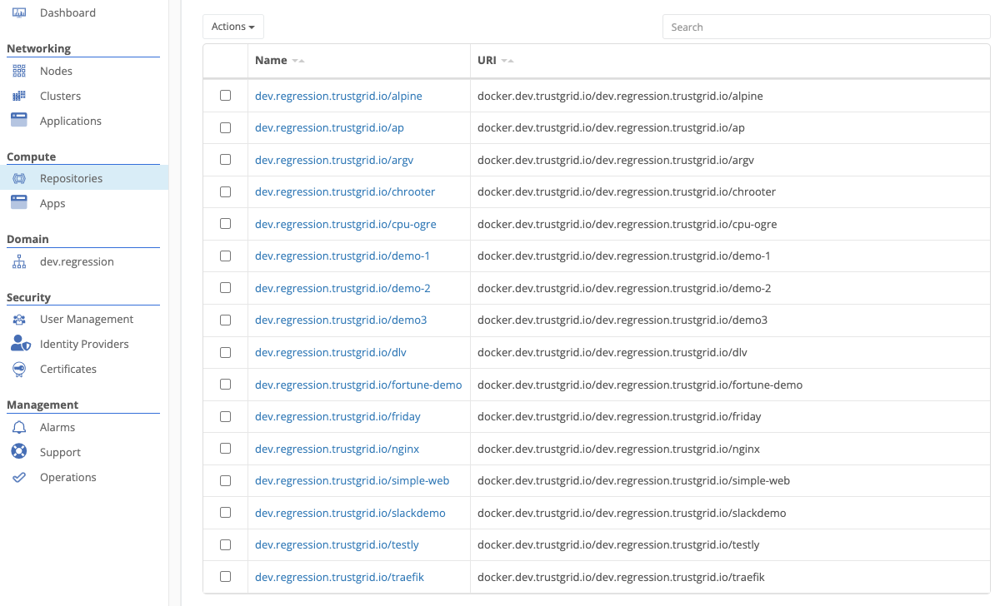
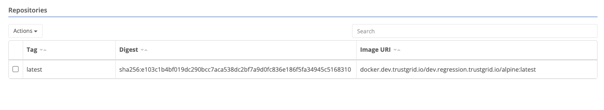

#### list view

Trustgrid provides a fully managed private container registry. Uploaded container images may be viewed by navigating to Repositories in the portal:

Users can push and pull containers from the repository.

#### docker login
To authenticate with the registry, use the command provided at the bottom of the repositories view. Authentication lasts approximately 24 hours.

#### container namespace
Each customer is isolated to their own container namespace. To upload or download a container, it must be named with your namespace as a prefix.

For example, to push a tomcat container to your registry:

`docker tag tomcat:latest docker.trustgrid.io/namespace.trustgrid.io/tomcat:latest
docker push docker.trustgrid.io/namespace.trustgrid.io/tomcat:latest`

#### container repo view
Each repository can be managed. Clicking into a container will show its uploaded tags and digests, as well as the URI that can be used to pull the container.

#### node container auth
Trustgrid nodes authenticate automatically with the Trustgrid container registry and can pull any image uploaded to the registry.