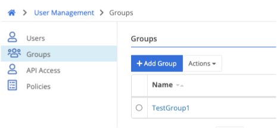

User Management Groups defined can be used to make Remote Access applications visible to users.

## Types of Groups

### Trustgrid-Native Groups

These groups are created in the Portal via the `Add Group` button. Membership is managed directly within the Portal by administrators.

### Identity Provider-Synchronized Groups

These groups are created based on Identity Provider (IdP) configuration for select IdPs (currently G Suite and Azure OpenID). The IdP can be configured to sync all or select groups, and the sync process will update the group membership automatically.

> if users are added to an IdP-synced group in the Trustgrid portal they will automatically be removed the next time they sync runs.

## Group Management

### Manage Group Members (Trustgrid-native groups)
The members of a group can be viewed from the group details page under the "Users" tab. 

This tab can also be used to add or remove group members for Trustgrid-native groups.
#### Add Users to Group
1. Navigate to the group's detail page by going to User Management > Groups and selecting the desired group. 
1. The Users tab should already be selected. 
1. Click the `+Add Member` button.
1. Search for and select the email address of the desired user. 
1. Click Save.
1. Optionally, repeat with additional users. 

#### Remove Users from Group
1. Navigate to the group's detail page by going to User Management > Groups and selecting the desired group. 
1. The Users tab should already be selected. 
1. Select the radio button to the left of the desired users. 
1. From the Actions drop-down menu select Delete.
1. When prompted confirm the removal by clicking Ok. 
1. Optionally, repeat with additional users. 

### Manage Group Permissions
Permissions can be granted to members of a group by attaching a [policy]() to the group. This is done on the group details page under the "Permissions" tab.

The permissions tab will also show the effective permissions of all policies attached to a group.

#### Attach Policy to Group
1. Navigate to the group's detail page by going to User Management > Groups and selecting the desired group. 
1. Select the Permissions tab.
1. Click the `+Attach Policy` button.
1. Select the desired group.
1. Click Attach
1. Optionally, repeat with additional policies.

#### Detach Policy from Group
1. Navigate to the group's detail page by going to User Management > Groups and selecting the desired group. 
1. Select the Permissions tab.
1. Locate the policy you wish to remove from the table of attached policies and click the Detach button to the right.

