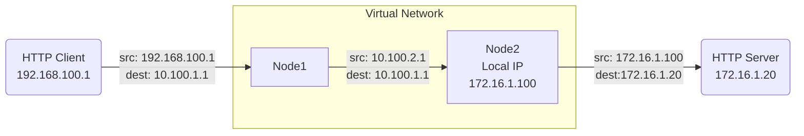

{}
Flow logs are a records of for network traffic that passes through a node. They can be used to troubleshoot connectivity issues, or to monitor traffic patterns. 
{}

## What are flow logs?
Flow logs are records containing metadata about each network traffic flow, or conversation, from the initial connection (e.g. the first SYN packet for TCP) to the closing of the connection (e.g. FIN or RST packets for TCP). Flow logs **do not contain any payload data** for the flow which makes them much smaller and more secure than a full packet capture of the same flow.

Flow logs can be used for troubleshooting by:
 - Verifying that both the expected source and destination node have the appropriate logs.
 - That any [NATs](#nat-impact-on-source-and-destination-fields) are applying as expected.
 - That the expected number of flows or sent/received byte are being passed. 
 - TCP Flags can be used to confirm a successful connection is being made. For example:
   - A TCP Flow with only a SYN flag is never completing the TCP Handshake process indicating an issue, such as a firewall or routing configuration problem, preventing the destination IP from either receiving packets or replying successfully
   - A TCP Flow with only a SYN & RST flag indicates something in the path is actively resetting the connection attempt. This could be a firewall or an application IP restriction.

### Flow Log Data
Below are the potential fields of a single flow log.



The time the flow started


The time the flow ended


The protocol of the traffic TCP, UDP, ICMP


The node that initiated the flow


The IP address through which the node initiated the flow


The port through which the node initiated the flow


The node that received the flow


The IP address to which traffic was sent


The port to which traffic was sent


Bytes received at the source node


Bytes sent from the source node


All TCP Flags set on any packets seen over the duration of the flow:

- SYN - sync packet
- PSH - push packet
- ACK - ack packet
- URG - urgent packet
- FIN - finish packet
- RST - reset packet

TCP Flags are only available for **TCP** flows that traverse the layer 3 VPN function. ICMP and UDP traffic, [Layer 4 services]() and [VPN Port Forwards]() will not have this data.





### NAT Impact on Source and Destination Fields
When [NATs]() are applied to a flow they will influence the source/destination IP and port values.  

Consider this flow:

Node1 would report the flow before any NATs were applied

| Source IP | Destination IP |
|-----------|----------------|
| 192.168.100.1 | 10.100.1.1 |

Node2 would report the flow after the NATs on Node1 were applied (changing the source 10.100.2.1) and the NATs on Node2 were applied (changing the source to 172.16.1.100 and the destination to 172.16.1.20)

| Source IP | Destination IP |
|-----------|----------------|
| 192.168.100.1 | 10.100.1.1 | 

 For simplicity sake ports were excluded. Destination ports will not be changed by NATs.  Source ports would also be maintained for any 1:1 NAT, but would change if a many:1 (or overload) NAT was applied to the flow. 

## Viewing Flow Logs
Flow logs are visible at an organization level by navigating to [Operations > Flow Logs](). This will show you the most recent 1000 flows over the last two hours for the **all** nodes in the organization.

To view Flow Logs only for traffic through a specific node, navigate to that node and go to [History > Flow Logs](). This will show you the most recent 1000 flows over the last two hours for the **currently selected** node.



### Advanced Search

Flow logs can be filtered by any of the fields listed above. To filter by a field, click the `Advanced Search` button at the top right of the flow logs table.

In addition, the ordering can be changed so that oldest flows (or flows closest to the time range specified) can be shown first. There is a limit of 10,000 flows returned per search.



### Exporting Flow Logs to CSV
From the Flow logs table you can export the current filtered logs to a CSV file for further analysis or reporting. Several fields are exported differently in the CSV file: 

Below are the potential fields of a single flow log.



Both of these fields exported two different ways:
* Human friendly in the format: MM/DD/YYYY HH:MM:SS AM/PM
* Timestamp in milliseconds since epoch for machine parsing


TCP Flags are exported in hexadeximal format (e.g. 0x02 for SYN flag set) rather than the human friendly names.  See the below section for more info on converting these values.





#### Understanding TCP Flag Hex Values
  When exporting TCP flags to CSV, the values will be shown as hexadecimal numbers rather than the human readable names (e.g. SYN, ACK). The below table shows how each flag would be prepresented as a hex value or binary value.

  | Hex Value | Binary Representation | Flag Name   | Description                        |
|-----------|-----------------------|-------------|------------------------------------|
| `0x01`    | `00000001`            | FIN         | Finish (end of data communication) |
| `0x02`    | `00000010`            | SYN         | Synchronize sequence numbers       |
| `0x04`    | `00000100`            | RST         | Reset the connection               |
| `0x08`    | `00001000`            | PSH         | Push function                      |
| `0x10`    | `00010000`            | ACK         | Acknowledgment                     |
| `0x20`    | `00100000`            | URG         | Urgent pointer field significant   |
| `0x40`    | `01000000`            | ECE         | Explicit Congestion Notification Echo |
| `0x80`    | `10000000`            | CWR         | Congestion Window Reduced          |

The CSV export will show the hex value that represents the combination of set flags. For example, a flow with SYN and ACK flags set would show the hex value `0x12` in the CSV, representing the binary value `00010010`.

 The value shown is the total of ALL flags seen on all packets that are part of the flow. If you are only used to looking at the flags of individual packets you will see combinations not normal in regular TCP traffic.  For example a complete flow might have a SYN, ACK, RST and FIN. 

To convert hax flags to human readable format first convert to binary then check each bit position. 

To convert hex to binary you can:
- an online tool like [Binary to Hexadecimal Converter](https://www.binaryhexconverter.com/hex-to-binary-converter)
- searching google.com using the prompt `0x## to binary` (replacing the ## with the hex value)
- Use the `=HEX2BIN(hex_value)` function in Excel or Google sheets

Then you can use the resulting bit map with a table like below to convert to human readable flags:

|Example Hex|Binary Equivalent|CWR|ECE|URG|ACK|PSH|RST|SYN|FIN|
|---|---|---|-|-|-|-|-|-|-|-|
|`0xd6`|`1101 0110`|1|1|0|1|0|1|1|0|
|`0x1b`|`0001 1011`|0|0|0|1|1|0|1|1|
