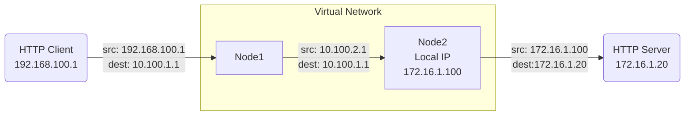

{}
Flow logs are a records of for network traffic that passes through a node. They can be used to troubleshoot connectivity issues, or to monitor traffic patterns. 
{}

## What are flow logs?
Flow logs are records containing metadata about each network traffic flow, or conversation, from the initial connection (e.g. the first SYN packet for TCP) to the closing of the connection (e.g. FIN or RST packets for TCP). Flow logs **do not contain any payload data** for the flow which makes them much smaller and more secure than a full packet capture of the same flow.

Flow logs can be used for troubleshooting by:
 - Verifying that both the expected source and destination node have the appropriate logs.
 - That any [NATs](#nat-impact-on-source-and-destination-fields) are applying as expected.
 - That the expected number of flows or sent/received byte are being passed. 
 - TCP Flags can be used to confirm a successful connection is being made. For example:
   - A TCP Flow with only a SYN flag is never completing the TCP Handshake process indicating an issue, such as a firewall or routing configuration problem, preventing the destination IP from either receiving packets or replying successfully
   - A TCP Flow with only a SYN & RST flag indicates something in the path is actively resetting the connection attempt. This could be a firewall or an application IP restriction.

### Flow Log Data
Below are the potential fields of a single flow log.



The time the flow started


The time the flow ended


The protocol of the traffic TCP, UDP, ICMP


The node that initiated the flow


The IP address through which the node initiated the flow


The port through which the node initiated the flow


The node that received the flow


The IP address to which traffic was sent


The port to which traffic was sent


Bytes received at the source node


Bytes sent from the source node


All TCP Flags set on any packets seen over the duration of the flow:

- SYN - sync packet
- PSH - push packet
- ACK - ack packet
- URG - urgent packet
- FIN - finish packet
- RST - reset packet

TCP Flags are only available for **TCP** flows that traverse the layer 3 VPN function. ICMP and UDP traffic, [Layer 4 services]() and [VPN Port Forwards]() will not have this data.





### NAT Impact on Source and Destination Fields
When [NATs]() are applied to a flow they will influence the source/destination IP and port values.  

Consider this flow:

```mermaid
graph LR
   client(HTTP Client\n192.168.100.1) -- src: 192.168.100.1\ndest: 10.100.1.1--> Node1
   subgraph Virtual Network
     Node1  -- src: 10.100.2.1\ndest: 10.100.1.1 --> Node2[Node2 \n Local IP\n172.16.1.100] 
   end
   Node2 --src: 172.16.1.100 \n dest:172.16.1.20 --> server(HTTP Server\n172.16.1.20)
```

Node1 would report the flow before any NATs were applied

| Source IP | Destination IP |
|-----------|----------------|
| 192.168.100.1 | 10.100.1.1 |

Node2 would report the flow after the NATs on Node1 were applied (changing the source 10.100.2.1) and the NATs on Node2 were applied (changing the source to 172.16.1.100 and the destination to 172.16.1.20)

| Source IP | Destination IP |
|-----------|----------------|
| 192.168.100.1 | 10.100.1.1 | 

 For simplicity, ports were excluded. Destination ports will not be changed by NATs.  Source ports would also be maintained for any 1:1 NAT, but would change if a many:1 (or overload) NAT was applied to the flow. 

## Viewing Flow Logs
Flow logs are visible at an organization level by navigating to [Operations > Flow Logs](). This will show you, by default, the last 2 hours of flows for **all** nodes in the organization.

To view Flow Logs only for traffic through a specific node, navigate to that node and go to [History > Flow Logs](). This will show you the flows for the **currently selected** node.



Viewing flows requires `audits::read:flows` permissions.

### Date Range

The date range selector is always visible above the flow logs table, showing the currently active time window. The default range is **Last 2h**. Click the date range button to change the range. The selector supports both relative ranges (e.g., Last 2h, Last 1w) and absolute date/time ranges. 

### Timezone

Use the **UTC/Local** toggle on the date range selector to switch between UTC and your local timezone. This affects all timestamps displayed in the table. CSV exports are always in UTC.

### Search Bar

The search bar at the top of the table performs a full text search across all fields. Type a search term and press Enter to filter the results. Searches match the full value of a field or trailing `*` can be used to do a wildcard match (e.g. `172.16.*`).

### Advanced Search

Click **Advanced Search** at the top right of the flow logs table to filter by any combination of the fields below. The ordering can also be changed so that the oldest flows appear first. There is a limit of 1,000 flows returned per paginated search.



#### IP Address Filtering

The **Source IP** and **Dest IP** fields accept multiple values. Type an IP address and press Enter to add it, then repeat to filter on several addresses at once.

These fields also support wildcard patterns using `*` to match any octet or partial octet. For example:
- `192.168.*` matches any IP starting with `192.168.`
- `10.*.1.*` matches any IP where the first octet is `10` and the third is `1`

Leading wildcards (e.g., `*.168.1.1`) are not supported.

#### CIDR Filtering

The **Source IP CIDR** and **Dest IP CIDR** fields filter flows by a CIDR range (e.g., `172.16.0.0/16`). When both an IP filter and a CIDR filter are set for the same direction, the CIDR filter takes precedence and the IP filter is ignored.

### Actions Menu

The gear icon above the table provides access to:

- **Refresh** - Refresh the table results
- **Export** - Download the current filtered flow logs as a CSV file for further analysis or reporting.
- **Column Selector** - Choose which columns are visible in the table.

Large exports may take a moment to prepare. A download button appears when the file is ready.

`Start Time` and `Stop Time` are both exported in two different formats:
* Human friendly in the format: MM/DD/YYYY HH:MM:SS AM/PM
* Timestamp in milliseconds since epoch for machine parsing and sorting



