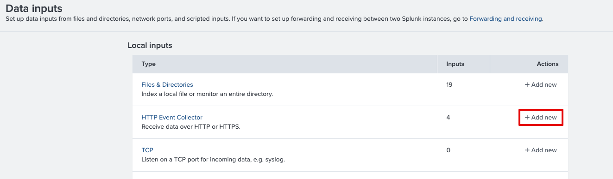
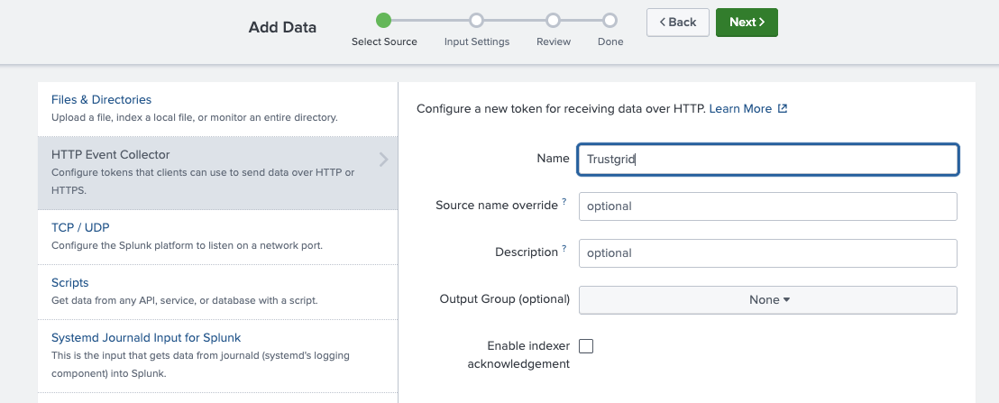
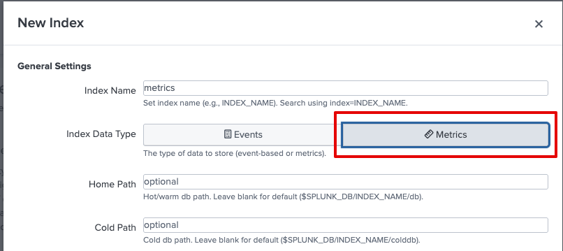
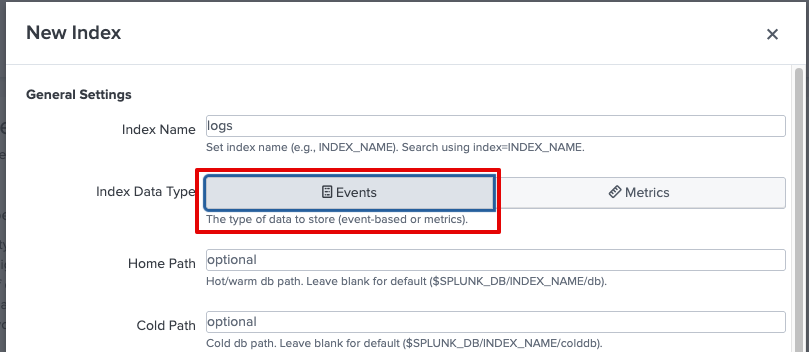
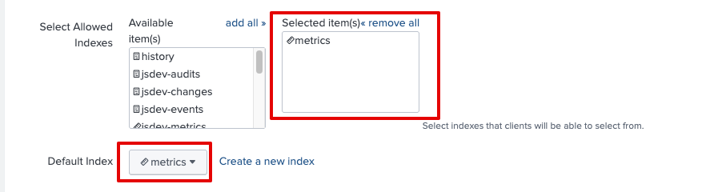
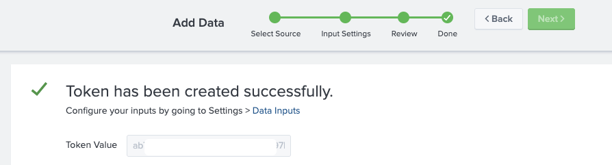
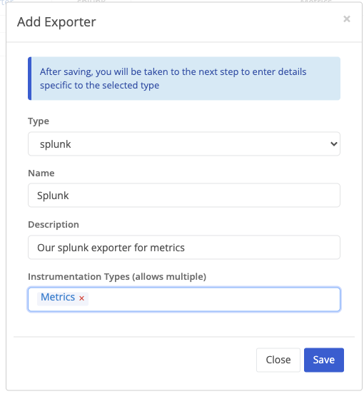
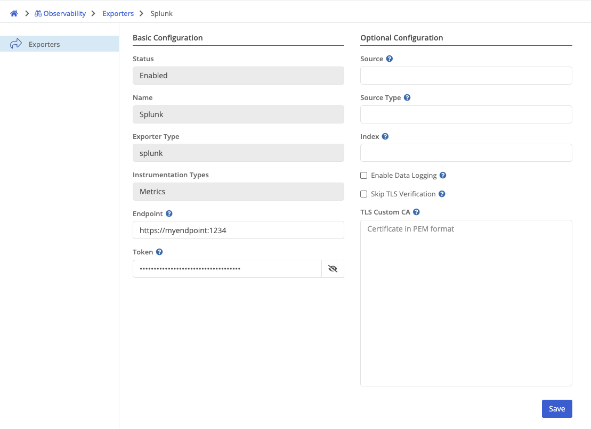

# Setting up Splunk for OpenTelemetry Export

This guide walks you through configuring **Splunk** and the **Trustgrid Portal** to export OpenTelemetry (OTEL) data via the HTTP Event Collector (HEC) integration.

---

## Part 1: Configure Splunk to Receive OTEL Data

### Step 1: Enable HEC in Splunk

1. Log into your Splunk instance.
2. Navigate to: **Settings > Data Inputs**
3. Click **Add New** next to **HTTP Event Collector (HEC)**  
   

---

### Step 2: Create a New Input

1. Enter a **Name** for the input (e.g., `Trustgrid`)
2. Leave other options at their default values unless otherwise required.
3. Click **Next**  
   

---

### Step 3: Create a New Index

1. On the **Input Settings** step, click **Create a new index**
2. Provide a name (e.g., `otel_metrics`) and set the **Index Data Type** to `Metrics` (Node Telemetry) or `Events` (Node Audits, Changes, Events)

   #### Metric index

   

   #### Event (Node Audits, Changes, Events) index

   

3. Save the new index
4. Ensure it's:
   - Added to the **Allowed Indexes**
   - Selected as the **Default Index**
     

---

### Step 4: Complete the Setup

1. Click **Review** and then **Done**
2. Copy the **Token Value** generated — you'll use this in the Trustgrid Portal setup  
   

---

## Part 2: Configure Trustgrid to Export OTEL Data

### Step 1: Access Exporter Settings

1. Log into the **Trustgrid Portal**
2. Navigate to: **Management > Observability**
3. Click **Add Exporter**

---

### Step 2: Configure Exporter

- **Type**: `splunk`
- **Name**: e.g., `splunk-prod-exporter`
- **Description**: Optional
- **Instrumentation Types** (select one or more):

  - `Metrics`
  - `Node Audits`
  - `Node Events`
  - `Changes`

---

### Step 3: Provide Endpoint Details

- **Endpoint**: The full URL to your Splunk HEC endpoint, e.g. `https://your-splunk-host:8088`
- **Token**: Paste the token you copied earlier
- **Source** / **Source Type**: Optional — maps to Splunk's source fields
- **Index**: Optional - The name of the index created in Splunk (e.g., `metrics`)
- **Enable Data Logging** Optional - Used when sending log data like Node Audits, Events, and Changes to Splunk
- **TLS Custom CA**: Optional - Upload a certificate if using a custom CA
- **Skip TLS Verification**: Optional - Will skip TLS certificate verification (TLS will still be enabled)

---
