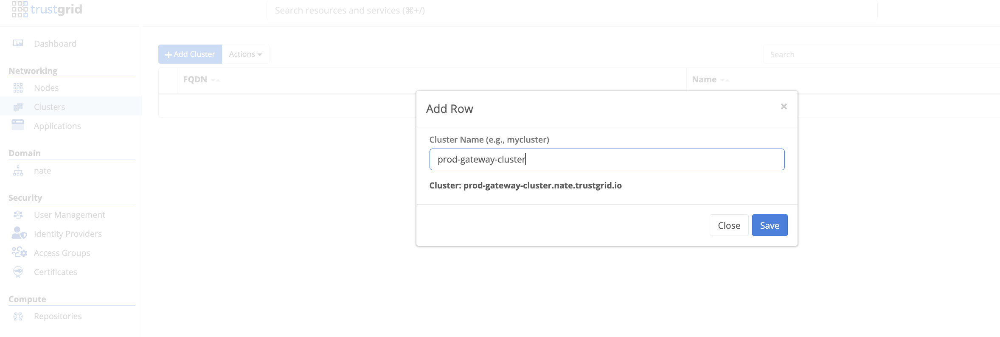
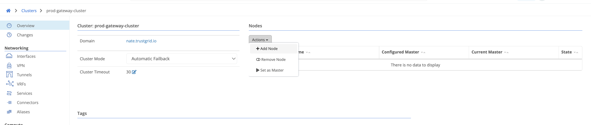
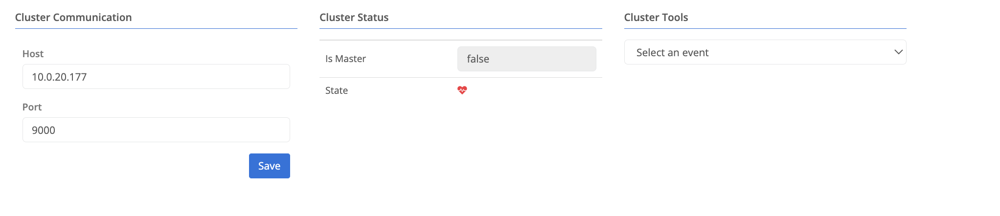
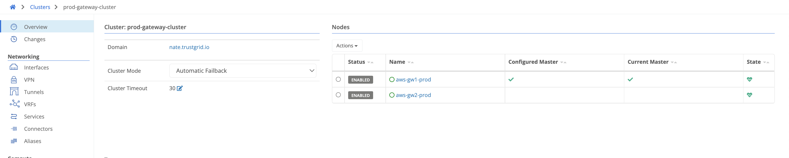
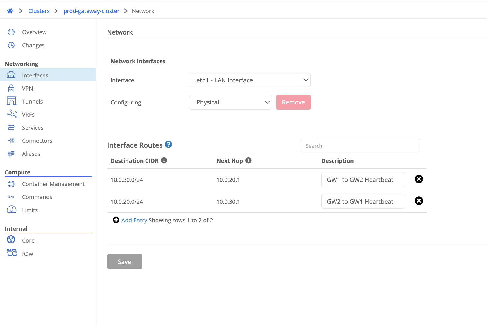

This tutorial covers AWS route failover for a clustered Trustgrid gateway deployment. On failover, the active member updates AWS route-table entries (`ec2:CreateRoute` / `ec2:DeleteRoute`) so that overlay CIDRs always point at the active member's data ENI — no floating IP required.

For the IP-based failover alternative, see [AWS Cluster IP Failover]().

## How it works

### Graceful Failover
1. The Trustgrid appliance relinquishing the active role removes its AWS route-table entries.
1. The appliance gaining the active role creates new route-table entries pointing at its own ENI.

### Ungraceful Failover
1. After the [Cluster Timeout]() period elapses, the appliance taking the active role removes the prior active node's route-table entries.
1. The now-active appliance creates new route-table entries pointing at its own ENI.

## Requirements

- AWS route table associated with the LAN subnet of the cluster members.
- IAM instance profile on each cluster member granting the permissions below.

### IAM Permissions Required

Each cluster member's IAM instance profile must allow:

```json
{
  "Effect": "Allow",
  "Action": "ec2:DescribeRouteTables",
  "Resource": "*"
},
{
  "Effect": "Allow",
  "Action": [
    "ec2:CreateRoute",
    "ec2:DeleteRoute"
  ],
  "Resource": "arn:aws:ec2:<region>:<account-id>:route-table/<rtb-id>"
}
```

Set the `Resource` field to the ARN of the route table associated with the data NICs. See [Deploy a Trustgrid Node AMI in AWS]() for full IAM role setup steps.

## Configuration Steps

1. Deploy a pair of Trustgrid gateways. Gateways can be in the same availability zone or different ones for greater redundancy. [Deploy a Trustgrid Node AMI in AWS]().

1. Under Networking > Clusters, create a cluster with a descriptive, unique name.
   

1. Select the cluster and add both gateways using the Actions dropdown.
   

1. Configure the cluster heartbeat on each gateway node under System > Cluster. Set the host to the interface IP you want to use for heartbeat traffic (WAN or LAN). The port defaults to TCP 9000 but can be any unused TCP port. Both security groups must allow bidirectional traffic on this port. Both members send heartbeats to each other; if the standby cannot reach the active member it promotes itself. Once configured both nodes should show healthy in the cluster view.
   
   

   If deploying gateways in different availability zones, add LAN interface routes to the cluster for both gateway LAN subnets. This ensures heartbeat traffic routes over the correct interface rather than the WAN interface.

   

1. Under Cluster > Interfaces > eth1 (LAN) > AWS Route Table Entries, add the CIDR covering the edge node IP space. For example, if all edge virtual-network addresses are carved out of `172.16.0.0/16`, add that single CIDR. Once saved, a route is created in the AWS route table pointing the CIDR at the active member's ENI. On failover the route is updated automatically to the new active member's ENI.

   Appropriate VPN configuration is still required for traffic to flow end-to-end between the gateway cluster and edge node sites.
