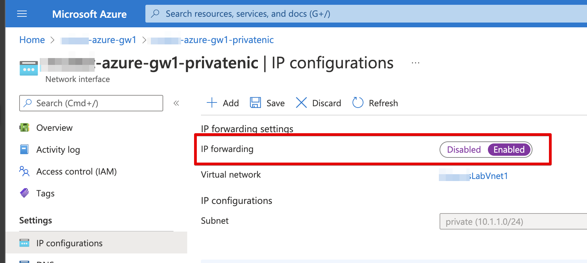
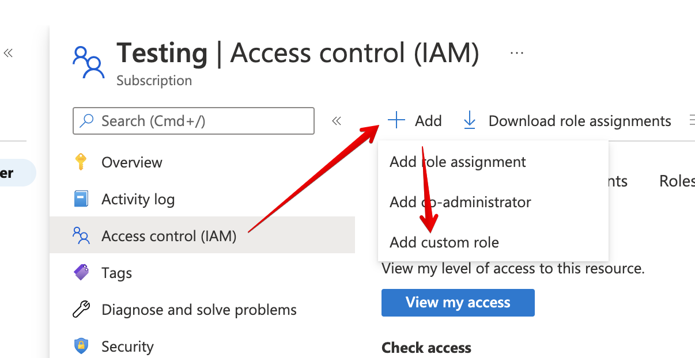
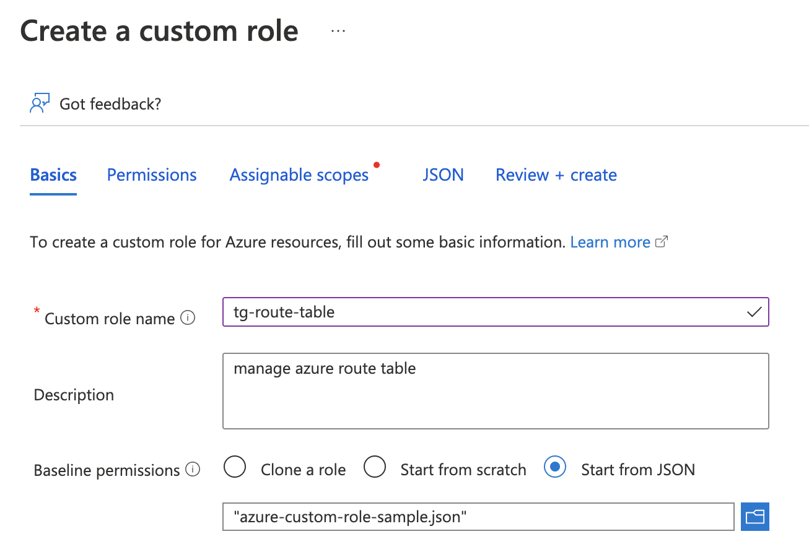
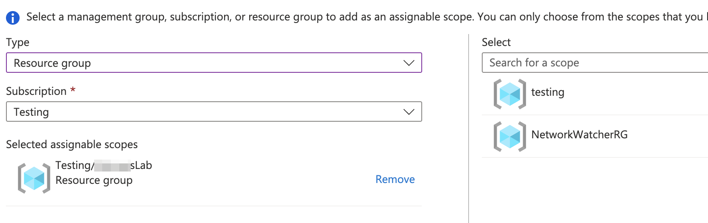
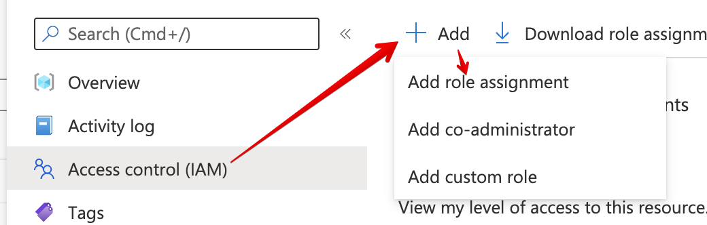
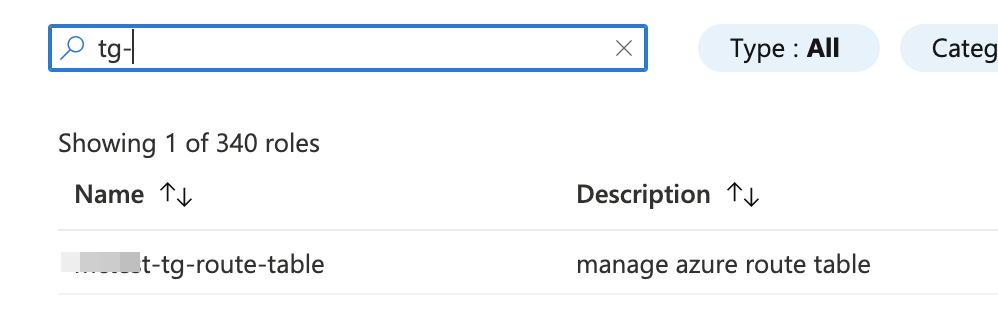
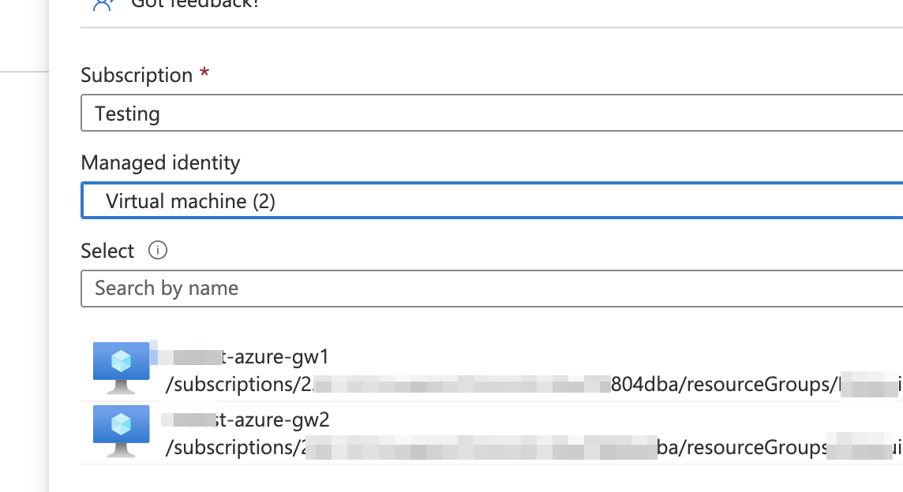

## Azure Requirements
- An Azure subscription. If you don't have one, create a [free account](https://azure.microsoft.com/free/)
- An Azure resource group to deploy the resources into
- An Azure Virtual Network (vNet) with at least two subnets:
  - An "outside" subnet for the appliance to connect to the Trustgrid control plane and data plane gateways, and accept incoming connections if the Azure Trustgrid appliance will be acting as a [data plane gateway]()
  - An "inside" subnet for communicating with other virtual machines and services within the Azure vNet
  - **(For Clustered Appliances)** An [Azure routing table]() associated with the "inside" subnet. 

## VM Requirements

| Requirement | Description      |
| ----------- | ---------------- |
| Disk Size   | At least 30 GB   |
| Interfaces  | <ul><li>1 Public with a Public IP address</li><li>1 Private</li><ul> |
| CPU & RAM   | See [Instance Type below]() for recommendations |

### Instance Size

Trustgrid has validated using the [B-series burstable - Azure Virtual Machines](https://learn.microsoft.com/en-us/azure/virtual-machines/sizes-b-series-burstable) instance type.

VPN throughput is tied to CPU the recommended size depends on roles, expected throughput.

- For Gateway nodes expecting up to ~200Mbps throughput, Trustgrid recommends the Standard_B4ms or larger
- For Edge nodes expecting less than 100Mbps throughput, Trustgrid recommends the Standard_B2s or Standard_B2ms or larger

### Interfaces

One WAN interface with a public IP and one LAN interface on a private subnet. The nodes will need to be able to route to all required hosts/applications that need to communicate across the Trustgrid virtual network.

The LAN interface needs to have **IP Forwarding Enabled** in order to forward the traffic across the tunnel.

See [Azure virtual network traffic routing](https://learn.microsoft.com/en-us/azure/virtual-network/virtual-networks-udr-overview).

### Supported Regions
The Trustgrid official community image, `trustgrid-node-2204-prod`, in the public gallery `trustgrid-45680719-9aa7-43b9-a376-dc03bcfdb0ac` is currently published in the following region.  If you need to deploy in another region please contact Trustgrid support. If you are not a direct customer of Trustgrid, please check with your vendor that is utilizing Trustgrid to have them contact support. 

| Region Display Name | Region Name |
|-|-|
|East US|eastus|
|Central US|centralus|
|North Central US|northcentralus|
|South Central US|southcentralus|
|West US|westus|

### Network Access

For gateways:

- Outbound internet access to the [Trustgrid control plane networks]() and ability to resolve public DNS names.
- Inbound access required is the TCP port defined for the Trustgrid gateway service to listen on. Edge nodes will connect to the gateways public IP and port defined. The default port used is 8443.

For edge nodes:

- Outbound internet access to the [Trustgrid control plane networks](), outbound access to the IP and ports of the Trustgrid gateways, and ability to resolve public DNS names.
- No inbound access is required on the public interface.

For all clustered nodes:

- The cluster heartbeat runs on the LAN/inside interface on TCP Port 9000. This port will need to be open between both Trustgrid Gateways for failover to work correctly.

### Other VM Requirements
* [System-assigned Managed Identity](https://learn.microsoft.com/en-us/azure/active-directory/managed-identities-azure-resources/qs-configure-portal-windows-vm) needs to be enabled for both VMs in the cluster. 
* [Boot Diagnostics](https://learn.microsoft.com/en-us/azure/virtual-machines/boot-diagnostics) needs to be enabled to allow access via the Serial Console

## Requirements for HA Failover

### Azure Routing Table

An Azure routing table resource needs to be associated with the LAN interface's subnet.

#### View LAN Subnet Routing Table

1. In the Azure Portal search for Virtual Networks and select the service
1. From the list of Virtual Networks select your target Virtual Network
1. From the navigation panel select Subnets
1. Select your inside/private subnet that is attached to the LAN interface of your Trustgrid VMs
1. There should be a route table


#### Create Route Table for LAN Subnet

1. If there is no Route Table associated with your LAN/inside/private subnet you will need to add it.
1. In the Azure portal search for Route Tables and select the service
1. Click the +Create button
1. Select the Resource Group that contains your Virtual Network and VMs
1. Select the Region that your VMs are deployed in
1. Give the Route Table a name consistent with your naming conventions
1. (Optional) change the Propagate Gateway routes option. 
1. Click Review + Create, review then click Review + Create again
1. Repeat the above steps to “View LAN Subnet Routing Table” and change the route table from None to the newly created Route Table.
1. Save the change

### Permissions Required for Cluster Route Failover

Copy this sample json file for use in creating a custom role with the required permissions. See process below.

> The assignableScopes section will need to be modified to represent the resource information of the target Azure account.


{
	"properties": {
		"roleName": "tg-route-table",
		"description": "manage azure route table",
		"assignableScopes": [
		],
		"permissions": [
			{
				"actions": [
					"Microsoft.Network/networkWatchers/nextHop/action",
					"Microsoft.Network/networkInterfaces/effectiveRouteTable/action",
					"Microsoft.Network/routeTables/routes/delete",
					"Microsoft.Network/routeTables/routes/write",
					"Microsoft.Network/routeTables/routes/read",
					"Microsoft.Network/routeTables/join/action",
					"Microsoft.Network/routeTables/delete",
					"Microsoft.Network/routeTables/write",
					"Microsoft.Network/routeTables/read",
					"Microsoft.Network/networkInterfaces/read",
					"Microsoft.Network/virtualNetworks/read",
					"Microsoft.Compute/virtualMachines/read"
				],
				"notActions": [],
				"dataActions": [],
				"notDataActions": []
			}
		]
	}
}


1. 1. A custom role needs to be created in the Azure subscription that allows the Trustgrid nodes to update the route table when failover occurs
	1. Create the custom role
		1. In the Azure portal search for “Subscriptions” and select the Subscriptions service
		1. Select the subscription that contains the Trustgrid VMs 
		1. Select “Access control (IAM),” then click “+Add”, then “Add custom role”

			

		1. Save the JSON above to a file named `azure-custom-role-sample.json`.
		1. Select “Start from JSON” and from the file selector, select the downloaded json file.

			

		1. Optionally, update the role name to meet your internal naming conventions.
		1. Click `Next`. 
		1. On the Permissions page you will see the permissions that will be granted. Click `Next` again.
		1. On the Assignable Scopes page click +Add Assignable Scope
			1. From the Type select Resource Group
			1. From the Subscription, select the subscription your VMs and virtual networks are in.
			1. From the Select pane on the right search for and select the Resource Group containing you VM’s

				

			1. Click `Select` and then `Next`.
		1. On the JSON page, click the `Next` button.
		1. Click Review + Create, then click Create.

1. Assign the custom role to your Trustgrid VM’s system-assigned
	1. In the Azure portal search for Resource Groups and select the service
	1. Select your target Resource Group
	1. Select the Access Control (IAM) panel, then click +Add, then “Add role assignment”

		

	1. Search for and select the desired role and click Next

		

	1. Under “Assign access to” select “Managed Identity” then click +Select members

		

	1. From the Managed Identity dropdown select Virtual Machine
	1. Select the identity for your first Trustgrid VM

		

	1. Click select. 
	1. Click +Select members again and repeat with your second Trustgrid VM
	1. Click “Review + Assign” then “Review + Assign” a second time

> These permissions can take some time to go into effect.

## Deployment Process

One of more Virtual Machines will need to be deployed into the target Azure subscription to act as the Trustgrid nodes using the official community image.  Then the [remote registration process]() can be used to activate the nodes in the Trustgrid portal.

### Participants

* Site Tech - User(s) with permissions and skills to deploy new instances in Azure, create the required Managed System Identity shown above, and make changes in Azure to allow the required network connectivity
* Trustgrid User - User with permissions to [Activate nodes]() in the Trustgrid portal (or API)

> If the Site Tech is not part of the organization that is a Trustgrid's direct customer, Trustgrid's professional service team will need documented approval from that customer before proceeding with assisting in the deployment.

### High-Level Process

1. The Site Tech should be able to complete the following steps independently:
	1. Build out prerequisite resources including Resource Groups, vNets, subnets and routing tables in Azure
	- For single node deployments: 
		1. Create VM Instances based of the official Trustgrid community image
	- For clustered deployments:
		1. Create a [routing table for the in LAN interface subnet]() if it does not already exist
		1. Create two VM Instances based of the official Trustgrid community image
		1. Create the Azure IAM role as defined above
	1. Use the Azure VM Serial Console to start the registration process, this code then needs to be communicated securely to the Trustgrid User. 
1. Trustgrid Tech - 
	1. Activate the device with the target organization
	1. Confirm healthy functionality and connectivity to the required gateways
	1. Configure the nodes as needed (e.g. clustering, VPN, L4proxy)

### Deployment Methods

- [Deploy via Azure command line tool]()

_Documentation Coming Soon for..._
- Deploy via the Azure Portal 
- Deploy via Azure Bicep modules