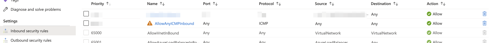
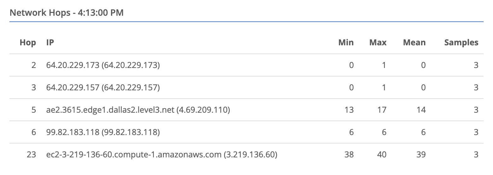
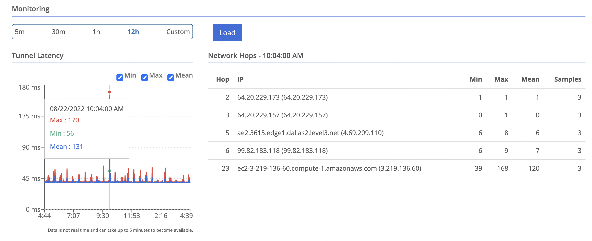

{}
This feature collects traceroute-like data from all its connected peers and stores the results in the Trustgrid cloud for historical review.  
{}

Network hop monitoring as described below requires the [April 2025 major appliance release]() or later. Versions from 20220808 until that version had no payload and were sent every 20 seconds

## How it Works

1. The node will send out TCP SYN packets to each peer's public IP and port (if a gateway) with incrementing Time To Live (TTL) values every 5 seconds.  The packets have a payload of 1440 bytes (or the smaller of 1440 or the WAN MTU minus 60 bytes) to attempt to spot any MTU issues. 
1. As the packets pass through each router (or hop) along the way the TTL is decreased by one.
1. Any time a router receives a packet with a TTL value of 1 it will drop the packet and can reply with an ICMP packet saying “Time to Live has been exceeded”
1. The node uses these ICMP packets to calculate the latency to each hop.

## Known Limitations

There are several known limitations to gathering this data:

- Routers on the internet are not required to respond with ICMP. This will lead to gaps in the Hop numbers.
- Those that do respond sometimes deprioritize their response which leads to misleading latency numbers.
- - If you see a hop with high values, but the values for higher hop numbers are normal this is not likely the cause of problems
- - **If a hop has high values and all subsequent hops have higher values this is likely the source of the latency/loss**
- Firewall rules have to allow the packets and the responses.
- - By utilizing the same TCP port as the gateway, all data collected from edge nodes should be allowed out.
- - Some firewalls/routers have trouble correlating the TCP request with the ICMP response which leads to no data
- Gathering this data requires compute resources on the node and the gateway. Trustgrid recommends only enabling on edge nodes that have frequent latency or packet loss issues as a troubleshooting tool.

## Enabling Network Hop Monitoring
There are two ways to enable hop monitoring:

### Enable on a Specific Edge Node
This method will configure the node in question to attempt hop monitoring to all connected gateway peers. 
1. Navigate to the node you want to enable
1. In the left side navigation bar select **Gateway** under the **System** section. Then click the **Client** panel. 
1. Set the **Monitor Hops to Gateway Servers** to **Always**. 
1. Click **Save**

## Enable on a Gateway Node
This method will tell all connected peers running the correct version of the node software to attempt hop monitoring to this specific gateway. 
1. Navigate to the gateway node you want to enable.
1. In the left side navigation bar select **Gateway** under the **System** section. Then click the **Server** panel. 
1. Set **Request Clients Monitor Hops** to Enabled.
1. Click **Save**

## Special Considerations

### Azure Nodes

If you enable this on an **edge** node running on an Azure VM, the default security group rules will prevent responses from intermediate hops on the path. You will still get data from the final hop, which is the target gateway.

You will need to add an inbound rule to the node's public interface network security group.

The rule needs the settings shown below:

The rule has to allow the destination of any which is not without risk. Make you weight the risks and benefits and are aware what VMs in Azure are using the same security group.

## Viewing Network Hop Data

1. Navigate to the node you want to view
1. Select `Data Plane` on the left
1. Select the peer you wish to view data for. You will see a table of hops appear in the bottom right. 
1. You can select a time point on the latency chart, and the hops table will update to show the data for that time point. 
