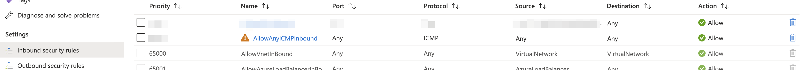
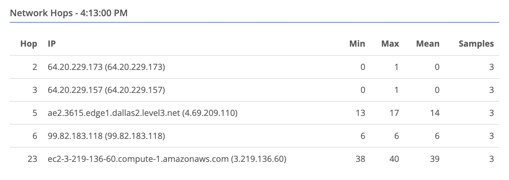
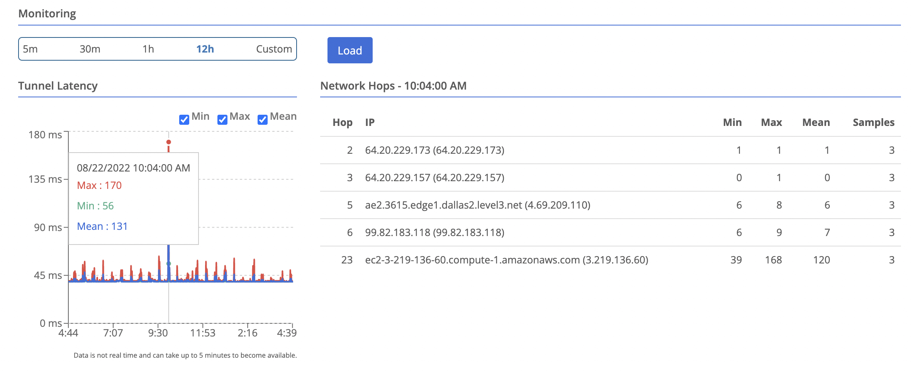

{}
This feature collects traceroute-like data from all its connected peers and stores the results in the Trustgrid cloud for historical review.  
{}

Network hop monitoring as described below requires the [August 2025 major appliance release]() or later. Versions from 20220808 until that version had no payload and were sent every 20 seconds

## How it Works

1. The node sends probes to each peer's public IP and port (if a gateway) with incrementing Time To Live (TTL) values.
1. As the packets pass through each router (or hop) along the way the TTL is decreased by one.
1. Any time a router receives a packet with a TTL value of 1 it will drop the packet and can reply with an ICMP packet saying “Time to Live has been exceeded”
1. The node uses these ICMP packets to calculate the latency to each hop.

As of the [June 2026 major appliance release](), hop monitoring behaves more like MTR to avoid being flagged as abnormal traffic by firewalls in the path. The node does not send resets to intermediate hops, completes the TCP handshake when a hop replies with a SYN/ACK, slows its probe rate further down the path, and stops once it reaches the gateway.

### Monitor Hops Protocol

Starting with the June 2026 release you can choose how the node probes the path using the **Monitor Hops Protocol** setting in the [Client]() panel:



- **SYN** probes using TCP SYN packets, reusing the gateway's TCP port so traffic already allowed out to the gateway is allowed for monitoring. This is the default and is the method prior versions used.
- **ICMP** probes using ICMP. Both the edge and gateway must allow the traffic, and it makes a lower-than-expected MTU along the path easier to detect.
- **SACK** builds a full TCP session and sends 1-byte TCP packets within it until it gets a response, then closes the session. This helps on paths where network devices do not handle bare SYN traces well.

## Known Limitations

There are several known limitations to gathering this data:

- Routers on the internet are not required to respond with ICMP. This will lead to gaps in the Hop numbers.
- Those that do respond sometimes deprioritize their response which leads to misleading latency numbers.
- - If you see a hop with high values, but the values for higher hop numbers are normal this is not likely the cause of problems
- - **If a hop has high values and all subsequent hops have higher values this is likely the source of the latency/loss**
- Firewall rules have to allow the packets and the responses.
- - By utilizing the same TCP port as the gateway, all data collected from edge nodes should be allowed out.
- - Some firewalls/routers have trouble correlating the TCP request with the ICMP response which leads to no data
- Gathering this data requires compute resources on the node and the gateway. Trustgrid recommends only enabling on edge nodes that have frequent latency or packet loss issues as a troubleshooting tool.

## Enabling Network Hop Monitoring
There are two ways to enable hop monitoring:

### Enable on a Specific Edge Node
This method will configure the node in question to attempt hop monitoring to all connected gateway peers. 
1. Navigate to the node you want to enable
1. In the left side navigation bar select **Gateway** under the **System** section. Then click the [**Client**]() panel. 
1. Set the **Monitor Hops to Gateway Servers** to **Always**. 
1. Click **Save**

## Enable on a Gateway Node
This method will tell all connected peers running the correct version of the node software to attempt hop monitoring to this specific gateway. 
1. Navigate to the gateway node you want to enable.
1. In the left side navigation bar select **Gateway** under the **System** section. Then click the [**Server**]() panel. 
1. Set **Request Clients Monitor Hops** to Enabled.
1. Click **Save**

## Special Considerations

### Azure Nodes

If you enable this on an **edge** node running on an Azure VM, the default security group rules will prevent responses from intermediate hops on the path. You will still get data from the final hop, which is the target gateway.

You will need to add an inbound rule to the node's public interface network security group.

The rule needs the settings shown below:

The rule has to allow the destination of any which is not without risk. Make you weight the risks and benefits and are aware what VMs in Azure are using the same security group.

## Viewing Network Hop Data

1. Navigate to the node you want to view
1. Select **Data Plane** on the left
1. Select the peer you wish to view data for. You will see a table of hops appear in the bottom right. 
1. You can select a time point on the latency chart, and the hops table will update to show the data for that time point. 

## Advanced Client Settings

In the [**Client**]() panel there are additional settings that can be changed to alter how hop monitoring is performed. These settings include options for adjusting the monitoring interval, payload size, and if the node should send reset packets for the TCP connections it attempts.

### Lowering the Interval

The default setting of 20 seconds provides 3 data points per minute.  Lowering the interval would provide additional granularity in the monitoring data, increasing the chance packet loss could be detected. However, could cause network devices in the path to view the increased traffic as a potential threat, leading to possible rate limiting or other security measures being applied.

### Increasing the Payload Size

A larger payload size can highlight lower than expected maximum transmission unit (MTU) values along the path. This can be useful for identifying potential bottlenecks or misconfigurations in the network. However, like an increased interval, it could cause network devices in the path to view the increased traffic as a potential threat, leading to possible rate limiting or other security measures being applied.

### Recommendation
Changing both these settings can be helpful if a node is seeing high latency to one or more peer devices, and the risk of the traffic being misidentified as a potential threat.  It is recommended to change these settings on nodes actively experiencing issues and monitoring the impact it has on the node, the peer and the overall connection performance.