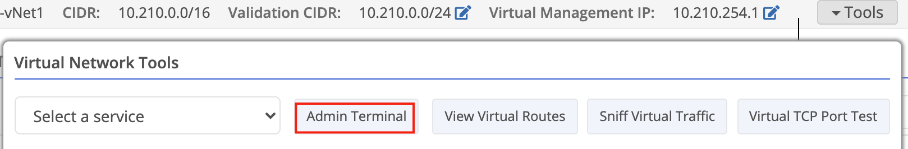

{}
The Traffic Capture tool performs a traffic capture on the selected node, which can help troubleshoot connectivity issues.
{}

## Summary

The [Sniff Interface Traffic tool]() allows you to monitor traffic in realtime but there are certain instances where you need to be able to capture traffic to a file for further analysis. For example, intermittent issues may require leaving a capture running for an unknown period of time. Or, perhaps you need to review the application data within the packet payload.

The Traffic Capture is started with a standard tcpdump filter, just like the sniff interface tool, and has a max capture file size. Once the capture is stopped the captured data is written to .pcap files which can then be transferred for review.

The pcap files will include part of the data payload of any communication captured. If a non-encrypted protocol (such as HTTP or FTP) is used this could be visible in clear text.

### High-Level Process
1. The capture is started by the user
1. While the capture is running the pcap files are created in a temporary location on the node.
1. When the capture is stopped the capture files are moved into the /home/tgguest/captures directory and ownership is transferred to the tgguest user.

## Access to Traffic Capture
Because of the risk of data being visible, there are several restrictions and controls in place:

1. The permission to run this tool (`node-advanced::service:tg-capture`) must be granted on a per-user basis in a [custom policy](). Not even administrators have this feature by default. 
1. **Trustgrid employees are specifically denied the ability to run this tool**. Trustgrid employees are not permitted to view data transferred through our devices, so please do not send us the resulting pcap files.

## Using Traffic Capture 
### Starting Traffic Capture
1. Log in to the Trustgrid portal and navigate to the node you want to capture traffic from.
1. Select **Interfaces** under the **Network** section. 
1. On the right side under Interface Tools use the dropdown to select Traffic Capture. .
1. The capture tool prompt will be displayed. Select the interface to capture from using the dropdown and enter a filter if desired. Click the start button to begin capturing. 
 Will display **Stopped** if the capture is idle or **Running** if there is an active capture. 
 This dropdown field will list the available interfaces. Select the one with the traffic you wish to capture
Input a valid [tcpdump filter](https://www.tcpdump.org/manpages/pcap-filter.7.html) to limit the captured traffic to only what is desired. An overly broad filter can cause the capture file to fill quickly and overwrite older data. 

See [useful filters](#useful-filters) below for additional information.
Specify the maximum size in megabytes for the pcap capture files. If this number is greater than 10MB the capture will be divided into the appropriate number of 10MB files to make the captures more manageable.  The maximum total size allowed is 1000MB (1G) which would be split into one hundred 10MB files.
If selected any existing pcap files in the captures directory will be deleted. This allows the user to be certain all capture files are related to the most recent run, and manages disk space consumption from multiple runs.

1. Click the start button to begin capturing traffic. A message will display to indicate the capture has started. The Traffic Capture dialogue can be closed and the capture will continue running in the background. 

### Stopping Traffic Capture
Once it is believe the desired traffic has been captured you will need to stop the running capture to get access to the pcap files. 

1. Log in to the Trustgrid portal and navigate to the node you want to capture traffic from.
1. Select **Interfaces** under the **Network** section. 
1. On the right side under Interface Tools use the dropdown to select Traffic Capture. .
1. Click the Stop button to end the capture. A message will display to indicate the capture has stopped and the files are being written.

## Transfer PCAP Files

Now that you have created the pcap files you will need to transfer them somewhere for analysis. The Trustgrid node has standard file transfer clients installed including scp, sftp, and ftp.

### On a Local Network

If the destination file server is on the local network of the node you will use the standard Terminal tool to run the file transfer commands.

1. Navigate to the node
1. Open a terminal from the toolbar at the top right

You will need to ensure that:

- The node has a valid route to the destination server's network
- Any firewall between the node and destination server allows the traffic
- The destination server is configured to allow the node IP to connect

Once you are in the terminal with the above configured an example scp command would look something like `scp ~/captures/capture-2021-07-16_17-59-23.pcap0 username@172.16.100.10:/captures/capture-2021-07-16_17-59-23.pcap`.

### Across the Virtual Network

If the destination file server is across a Trustgrid virtual network you will need to use the VPN Admin terminal to run the file transfer commands. This uses the nodes configured Virtual Management IP to communicate to remote resources.

1. Navigate to the node
1. Select the **VPN** panel. You may need to select the virtual network to use, if your device is connected to multiple.
1. Select the **Admin Terminal** button from the tools dropdown.

   

You will need to ensure that:

- The node has a virtual management IP assigned. The tool will not launch without this.
- A route for the virtual management IP exists in the virtual network route table.
- On the destination node, a 1:1 NAT exists for the destination file server assigning it to a virtual IP.
- A route that includes the destination file server's VIP exists in the network route table.
- A virtual network access policy exists that allows the source node's virtual management IP to connect to the destination file server's VIP on the required port for your protocol.
- The destination side node has a valid route to the destination server's network.
- Any firewall between the node and destination server allows the traffic.
- The destination is configured to allow the node IP to connect.

Once you are in the admin terminal with the above configured, an example SCP command would look like `scp ~/captures/capture-2021-07-16_17-59-23.pcap0 username@10.200.100.10:/captures/capture-2021-07-16_17-59-23.pcap`.

## Useful Filters

