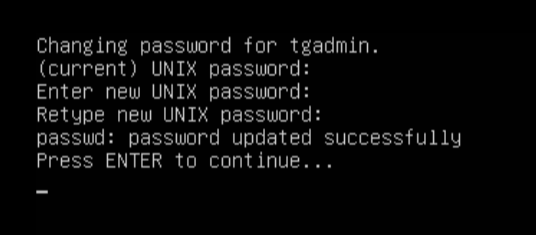

{}
The Trustgrid node console allows local console access to a Trustgrid Node whether a physical or esx node for the purposes of IP reconfiguration or network level troubleshooting and verification. 
{}

## Accessing the Trustgrid Console Utility

### Connecting to Trustgrid Local Console
- The following physical nodes can be connected via Keyboard and Monitor
    - Netgate - HDMI Monitor output, USB Keyboard
    - Protectli RM8B - VGA Monitor output, USB Keyboard
    - Dell Precision 3240 compact - DisplayPort Monitor Output, USB Keyboard
- The following devices support connecting  a serial cable connected to a laptop/desktop with the settings in the table below

| Device | Serial Port Type | Speed (bps) | Data Bits | Parity | Stop Bits | Flow Control |
|--------|------------------|-------------|-----------|--------|-----------|--------------|
| Lanner NCA-1210 | RJ45 | 115200 | 8 | None | 1 | None |
| Lanner NCA-1515 | RJ45 | 115200 | 8 | None | 1 | None |
| Lanner NCA-1010 | RJ45 | 115200 | 8 | None | 1 | None |
| Lanner NCA-1513 | RJ45 | 115200 | 8 | None | 1 | None |
---
 - VMware and Hyper-V based nodes can utilize the native console tools for each respective platform
 - AWS and Azure nodes can be accessed via each providers Serial Console option. This may require enabling additional feature on the EC2 instance/virtual machine

### Logging In
- Login with username `tgadmin` and password of **mac address of the wan nic** of the device **all lowercase including colons**. Example `82:f5:48:a9:14:05`

#### Finding the MAC Address
- If registered, the mac address can be seen on the [node's interface panel]() as the Hardware Address
- For Lanner NCA-1210 devices the serial number is the WAN MAC address without the colons. You'll need to add the colons.
- AWS and Azure list the MAC address in their management portals
    - AWS shows the MAC under the IP addresses section on the ENI properties 
    - Azure shows the MAC under properties of the virtual network interface. Note that they show the MAC in all upper case and with `-` instead of `:`. You will need to convert to lowercase and `:` when entering as the password 
- Determining the MAC will vary for other hardware models

## Trustgrid Local Console Dashboard
As seen below the console dashboard displays information on the current version of software the node is currently running as well as the connectivity/network status. 

 The below settings are only available on registered nodes. See [Remote Console Registration]() for working with unregistered nodes.

### Network Status
The network status section displays information about the node (name, domain, version, etc) as well as the current WAN IP address in CIDR format. Beneath this information it will display the health of the node's control plane connectivity

Can the node resolve DNS requests with the configured DNS servers 
Can the node connect to `zuul.trustgrid.io` on port `8443` 
Can the node connect to `repo.trustgrid.io` on port `443` 
Can the node retrieve updated configurations `gatekeeper.trustgrid.io` on port `443` 


Below is what is shown with successful connectivity:


And this shows a node unable to communicate:


### Changing a Trustgrid Node WAN IP via Trustgrid Console
 After the IP address is changed locally and it connects to the Trustgrid Cloud Controller, the new IP address must be saved in the portal to make the change permanent. If the device is rebooted prior to that it will revert to the previous configuration. 

To change the nodes WAN IP address:

1. Enter the console utility and login with the username `tgadmin` and the password of the mac address of the WAN interface of the device.
1. Select **Network Configuration** from the main menu.  If the Trustgrid service is unreachable this option will not be available. Use the [Advanced Network Configuration]() option to modify the IP settings. 
1. The current settings will be displayed and you will be presented with two options, DHCP or Static IP. 
    1. Selecting DHCP will cause the device to attempt to obtain an IP address from the DHCP server and restart the Trustgrid service.
    1. Selecting Static IP will open a dialog box where you can enter the IP address, netmask, gateway, and DNS server information. 
        1. Adjust the settings as desired and use **TAB** to select **OK** to save the settings.
        1. The device will apply the changes and ask if you wish to save the changes permanently. Select **Yes** to save the settings. 
        1. The Trustgrid service will be restarted.
1. Use **Back** to return to the main menu.       
1. Once returned to the main menu you should be able to see if the node was able to [successfully communicate with the Trustgrid control plane]().

### Changing the Default Password
The `tgadmin` user’s password can be changed by selecting option 3.

You will then need to enter the current password (mac address of wan nic all lowercase with colons) followed by the new password. 

> After this password is changed it can only be reset if the device successfully connects to the Trustgrid control plane. Please ensure the password is appropriately documented for future use.

