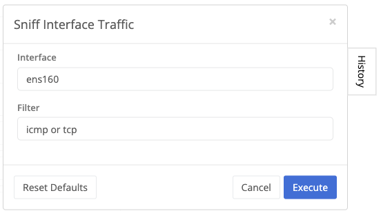
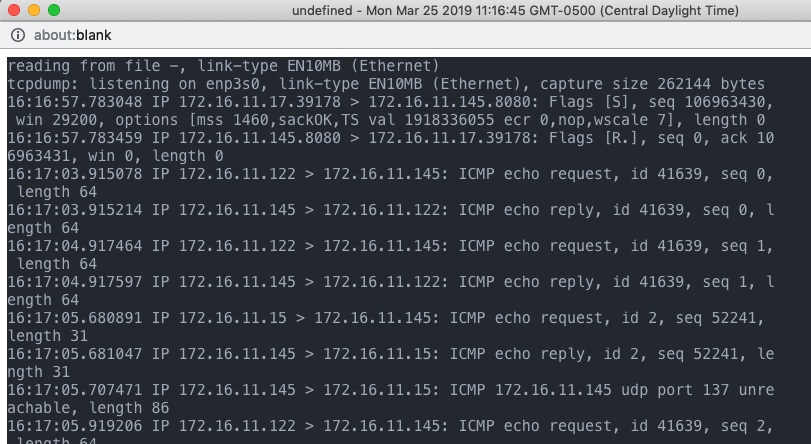

{}
The sniff interface traffic tool performs a traffic capture on the selected node, which can help troubleshoot connectivity issues.
{}

## Accessing & Using Sniff Interface Traffic

1. Login to the Trustgrid portal and navigate to the Node from which you want to capture traffic.
1. Select `Interfaces` under the `Network` section.
1. Click the Sniff Traffic button

   

1. Set the appropriate parameters.  
   The interface name
   The tool utilizes [TCPDump filtering syntax](https://www.tcpdump.org/manpages/pcap-filter.7.html), which can help isolate interesting traffic. The below filter would show only ICMP and TCP traffic
   
1. Click `Execute` to view the captured traffic

## Useful Filters

The below filters can be combined using "and" & "or" without quotes

- You can filter based on protocol such as "tcp", "udp", or "icmp" without quotes
- Best practice is to filter for what you want to see rather than filter out what you don't want to see
- To see only traffic for a specific host use "host x.x.x.x" with the IP address in place of the x.x.x.x
- To see only traffic for a specific port use "port XXXX" replacing the XXXX with the desired port number
- If capturing traffic on a clustered node, you should filter out the cluster port traffic. Typically port 9000 or 1975. E.g., `not port 9000`
- If capturing on the ETH0 - WAN Interface, you should filter out traffic to both Trustgrid's network (35.171.100.16/28) and your data plane gateways' network or public IP. You'll need to identify the actual network or IPs. E.g., `not net 35.171.100.16/28 and not net X.X.X.X/X` or `not net 35.171.100.16/28 and not host X.X.X.X`.
